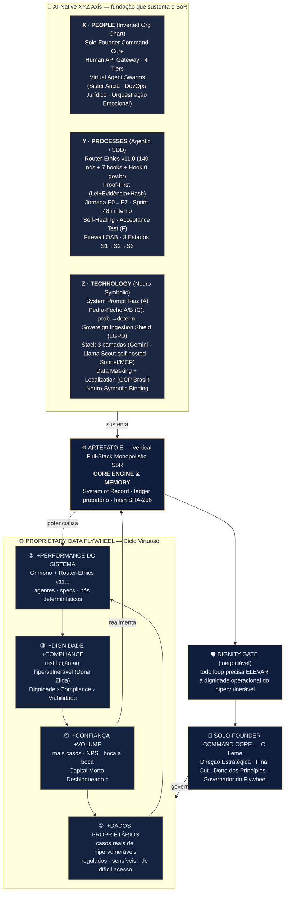

# 🔁 Proprietary Data Flywheel — Meu Cumpadre

> [!abstract] SUPERSEDIDO por v1.1
> Esta v1.0 foi superada por [[MC-BLUEPRINT-DataFlywheel-SoR-v1_1-2026-0603]] em 2026-06-03, que soma **Skybridge** (36 passarelas), os **3 scores do Router-Ethics** e o **Circuit Breaker Fênix**. Mantida como histórico — usar a **v1.1** como referência vigente.

> **Vertical Full-Stack Monopolistic System of Record (SoR) · Artefato E**
> Marco Fundacional 2026 · Hierarquia inviolável: **Dignidade › Compliance › Viabilidade**
> *Lucro é combustível, causa é destino, jogo é infinito.*

> [!warning] Status PROVISIONAL
> Roteado da drop zone ao canônico `02-ARQUITETURA/` em 2026-06-03. **Ainda não selado** — não citar como decisão sem confirmação explícita do founder (conv. 16.4). Selagem formal pendente.

**Versão PDF on-brand:** [[MC-BLUEPRINT-DataFlywheel-SoR-v1_0-2026-0603.pdf]] (em `02-ARQUITETURA/ativos-visuais/`)

---

## 1 · Diagrama mestre (Mermaid — renderiza no Obsidian, paleta on-brand)



---

## 2 · Diagrama mestre (ASCII — fallback / terminal)

```text
        P R O P R I E T A R Y   D A T A   F L Y W H E E L   ·   MEU CUMPADRE
        Vertical Full-Stack Monopolistic System of Record  (Artefato E)
        Marco Fundacional 2026   ·   Dignidade › Compliance › Viabilidade
        ───────────────────────────────────────────────────────────────────

   ┌────────────────────────────┐          ┌────────────────────────────┐
   │ [1]  + DADOS PROPRIETÁRIOS  │ ───────▶ │ [2]  + PERFORMANCE          │
   │      casos reais de         │   gira   │      Grimório +             │
   │      hipervulneráveis       │    ▷     │      Router-Ethics v11.0    │
   │  regulados·sensíveis·raros  │          │  140 nós + 7 hooks · D›C›V  │
   └──────────────┬─────────────┘          └─────────────┬──────────────┘
                  ▲                                       │
                  │         ┌───────────────────────┐    │
                  │         │   ARTEFATO E  (SoR)    │    │
                  │         │  CORE ENGINE & MEMORY  │    │
                  │         │  ledger · hash SHA-256 │    │
                  │         └───────────────────────┘    │
                  │             ▲ sustenta │ governa      ▼
   ┌──────────────┴─────────────┐          ┌────────────────────────────┐
   │ [4]  + CONFIANÇA + VOLUME   │ ◀─────── │ [3]  + DIGNIDADE +          │
   │      mais casos · NPS       │   gira   │      COMPLIANCE             │
   │  Capital Morto              │    ◁     │  restituição ao             │
   │  Desbloqueado ↑ (NorthStar) │          │  hipervulnerável · D›C›V    │
   └────────────────────────────┘          └────────────────────────────┘
                                │
                                ▼   o SoR é SUSTENTADO por 3 eixos (XYZ)
   ┌──────────────────────┐┌──────────────────────┐┌──────────────────────┐
   │ X · PEOPLE           ││ Y · PROCESSES        ││ Z · TECHNOLOGY       │
   │ Inverted Org Chart   ││ Agentic / SDD        ││ Neuro-Symbolic       │
   ├──────────────────────┤├──────────────────────┤├──────────────────────┤
   │• Solo-Founder        ││• Router-Ethics v11.0 ││• System Prompt Raiz A│
   │  Command Core (Leme) ││  140 nós + 7 hooks   ││• Pedra-Fecho A/B (C) │
   │• Human API Gateway   ││• Proof-First         ││  prob.→determinístico│
   │  4 Tiers T1·T2·T3·T4 ││  Lei+Evidência+Hash  ││• Sovereign Ingestion │
   │• Virtual Agent Swarms││• Jornada E0→E7       ││  Shield (LGPD)       │
   │  Sister Anciã        ││  Sprint 48h interno  ││• Stack 3 camadas     │
   │  DevOps Jurídico     ││• Self-Healing + AccT ││  Gemini·Llama·Sonnet │
   │  Orquestração Emoc.  ││• Firewall OAB        ││• Data Masking + Local│
   │                      ││  CNAE 6201-5/01      ││  (GCP Brasil)        │
   │                      ││• 3 Estados S1→S2→S3  ││• Neuro-Symb. Binding │
   └──────────────────────┘└──────────────────────┘└──────────────────────┘
   ┌──────────────────────────────────────────────────────────────────────┐
   │ DIGNITY GATE (inegociável) — todo loop precisa ELEVAR a dignidade      │
   │ operacional do hipervulnerável.   Dignidade › Compliance › Viabilidade │
   └──────────────────────────────────────────────────────────────────────┘
   ┌──────────────────────────────────────────────────────────────────────┐
   │ SOLO-FOUNDER COMMAND CORE — O Leme                                     │
   │ Direção Estratégica · Final Cut · Dono dos Princípios · Governa o ciclo│
   └──────────────────────────────────────────────────────────────────────┘
```

---

## 3 · Tradução: genérico → canônico Meu Cumpadre

| Caixa genérica | Tradução canônica MC | Por quê |
|---|---|---|
| More High-Quality Proprietary Data | Casos reais de hipervulneráveis entrando pela **Jornada E0→E7** sob **Sovereign Ingestion Shield** | O dado não é "coletado", é **custodiado** (3 Estados S1→S2→S3) |
| Better System Performance (Agents+Specs) | **Grimório** (3.265+ regras) + **Router-Ethics v11.0** afiados a cada caso | Performance = mais nós determinísticos, não só "modelo melhor" |
| Higher Dignity+Compliance for Dona Zilda | Idem + **Dignity Gate** + hierarquia **D › C › V** | Dignidade é *gate*, não *resultado* — bloqueia o loop se não subir |
| More Trust+Volume (Cases) | Confiança/NPS + **North Star = Capital Morto Desbloqueado** (não ARR) | O KPI do MC mede direito restituído, não receita |
| SoR (Artefato E) | **Vertical Full-Stack Monopolistic SoR** = ledger probatório c/ hash SHA-256 | É o eixo do volante, não um quadro lateral |
| X · People (Inverted) | + **Human API 4 Tiers** (T2 Empatia>Inteligência; **T4 = Dra. Juliana Melo**, Marketplace Ético) | A inversão é organizacional *e* de valor |
| Y · Processes | + **Jornada E0→E7**, **Sprint 48h interno**, **Firewall OAB** (CNAE 6201-5/01) | Atividade-*meio*: nunca invade atividade-fim |
| Z · Technology (Neuro-Sym) | + **Stack 3 camadas** (Gemini · Llama 4 Scout *self-hosted* · Sonnet 4.6 via MCP), **Pedra-Fecho A/B** (prob→determ) | Dado sensível só roda no Llama self-hosted (LGPD) |
| Solo-Founder Command Core | **O Leme** = Alessandro (22 anos INSS = moat ontológico) | O fundador *é* o produto externalizado |

---

## 4 · Como o volante gira no MC (leitura executiva)

1. **Entrada (eixos Z + Y).** Caso de hipervulnerável entra pelo **Human API Gateway** → triado pelo **Router-Ethics v11.0** (D›C›V, Hook 0 gov.br antes de tudo) → dados sensíveis isolados no **Llama 4 Scout self-hosted** (Sovereign Ingestion Shield). Cada peça vira **Proof-First** (Lei + Evidência + Hash SHA-256).
2. **Registro no eixo (SoR).** Tudo é gravado no **Artefato E**. A **Pedra-Fecho A/B** converte saída *probabilística* do LLM em **regra determinística do Grimório** — é aqui que o sistema "aprende" sem alucinar (Neuro-Symbolic Binding).
3. **Aceleração.** Mais casos processados com dignidade → mais regras no Grimório + mais nós no Router-Ethics → agentes mais afiados → **o próximo caso custa menos e fecha melhor**. O volante ganha inércia.
4. **Moat (por que players genéricos não copiam).** O dado é **regulado, sensível e de difícil acesso**; a governança (**Firewall OAB + Dignity Gate + LGPD**) é rígida; e a integração é **vertical do intake à decisão administrativa suportada**. Um LLM horizontal não tem o Grimório, nem os 22 anos de INSS, nem a custódia fiduciária (3 Estados).
5. **Governança.** O **Solo-Founder Command Core (O Leme)** decide quando o ciclo está saudável, aprova specs e é dono dos princípios. O **Dignity Gate** tem poder de veto: **loop que não eleva a dignidade do hipervulnerável não fecha** — mesmo que seja eficiente.

---

## 5 · Notas de coerência canônica

- **Dona Zilda ≠ JER001.** "Dona Zilda" é o **arquétipo** do hipervulnerável (Teste Zilda-STF, "5ª série"). A **primeira prova real** do flywheel girando ponta-a-ponta é a **JER001 (Hib001)** — caso-âncora empírico, não símbolo. As duas não se fundem.
- **Router-Ethics v11.0** (140 nós + 7 hooks + Hook 0 gov.br; blocos D01-D45 / C46-C90 / V91-V140). Canônico: `02-ARQUITETURA/router-ethics/_MC-RouterEthics_11_v1_1-2026-0505-CLevel.md`. ⚠️ A *skill* Orquestrador Mestre ainda referencia 10.0/105 nós — **sincronizar numa próxima selagem**.
- **North Star = Capital Morto Desbloqueado (CMD)**, nunca ARR convencional.
- **Firewall OAB:** atividade-meio CNAE 6201-5/01 — o SoR organiza evidência, não pratica atividade-fim.

---

## 6 · Próximas iterações candidatas (não executadas)

- Plotar as **36 passarelas cross-vertical (skybridge)** orbitando o SoR (constelação de 9 verticais).
- Instrumentar os **3 scores do Router-Ethics** (Confidence / Complexity / Fraudscore) como painel do Leme.
- Acoplar o **Circuit Breaker Fênix** como desvio de emergência fora do anel.

---

## 7 · Referências cruzadas

[[_MC-RouterEthics_11_v1_1-2026-0505-CLevel]] · [[MC-MANIFESTO-NovaOrdem-v1.0-2026-0427]] · [[MC-ADR-007-CampoPrecificacao-v3_2-2026-0427]] · ADR-008 (stack 3 camadas) · ADR-009a/b (custódia + 3 Estados) · [[OURO]] (Capital Morto Desbloqueado) · Caso Hib001 (JER001)

---

> *"O diamante é carbono que não desistiu da pressão."*
> **Hierarquia:** Dignidade > Compliance > Viabilidade · **Âncora:** Provérbios 31:8
> Meu Cumpadre — Hybrid Vertical AI Full Stack Company · PROPRIETÁRIO INVIOLÁVEL
∞
