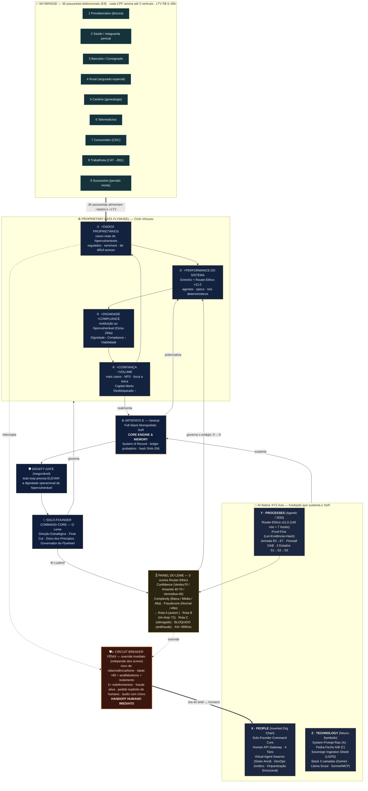

# 🔁 Proprietary Data Flywheel — Meu Cumpadre · v1.1

> **Vertical Full-Stack Monopolistic System of Record (SoR) · Artefato E**
> Marco Fundacional 2026 · Hierarquia inviolável: **Dignidade › Compliance › Viabilidade**
> *Lucro é combustível, causa é destino, jogo é infinito.*

> [!warning] Status PROVISIONAL
> Evolui a v1.0 (rascunho de laboratório, 2026-06-03). **Não selado** — não citar como decisão sem confirmação explícita do founder (conv. 16.4). Selagem formal pendente.

**Versão PDF on-brand:** [[MC-BLUEPRINT-DataFlywheel-SoR-v1_1-2026-0603.pdf]] (em `02-ARQUITETURA/ativos-visuais/`)

> [!note] Changelog v1.0 → v1.1
> Somados três subsistemas canônicos ao volante: **(1) Skybridge** — constelação de 9 verticais + 36 passarelas bidirecionais orbitando o SoR; **(2) Painel do Leme** — os 3 scores do Router-Ethics (Confidence / Complexity / Fraudscore) e a malha de roteamento A/B/C/Bloqueio; **(3) Circuit Breaker Fênix** — desvio de emergência que tira o caso do anel automático e o entrega ao humano.

---

## 1 · Diagrama mestre (Mermaid — renderiza no Obsidian, paleta on-brand)



---

## 2 · Diagrama ASCII (fallback / terminal)

```text
        P R O P R I E T A R Y   D A T A   F L Y W H E E L  ·  MEU CUMPADRE — v1.1
        Vertical Full-Stack Monopolistic System of Record (Artefato E)
        Dignidade › Compliance › Viabilidade
        ───────────────────────────────────────────────────────────────────

   🌉 SKYBRIDGE — 9 verticais · 36 passarelas bidirecionais (K9) · até 5/CPF · LTV R$ 5–50k
   ┌──────────────────────────────────────────────────────────────────────┐
   │ 1 Previd.(âncora) · 2 Saúde · 3 Bancário · 4 Rural · 5 Cartório        │
   │ 6 Telemedicina · 7 Consumidor · 8 Trabalhista · 9 Sucessório           │
   └─────────────────────────────────┬────────────────────────────────────┘
                                      ▼  alimentam +DADOS e +LTV
   ┌────────────────────────────┐          ┌────────────────────────────┐
   │ [1] +DADOS PROPRIETÁRIOS    │ ───────▶ │ [2] +PERFORMANCE            │
   │     casos de hipervuln.     │   gira   │     Grimório+RouterEthics   │
   └──────────────┬─────────────┘          └─────────────┬──────────────┘
                  ▲                  ┌──────────────┐     │
                  │                  │ ARTEFATO E   │     ▼
                  │                  │ (SoR) núcleo │  [PAINEL DO LEME]
                  │                  └──────────────┘  Confidence/Complexity/
   ┌──────────────┴─────────────┐          ┌──────────┐ Fraudscore → A/B/C/BLOQ
   │ [4] +CONFIANÇA +VOLUME      │ ◀─────── │ [3] +DIGN│
   │     Capital Morto ↑         │   gira   │  +COMPL. │
   └────────────────────────────┘          └──────────┘
                  ╎ intercepta
                  ▼
   ┌──────────────────────────────────────────────────────────────────────┐
   │ 🔥 CIRCUIT BREAKER FÊNIX (override imediato, independe dos scores):     │
   │ risco vida/violência/fome · >80+analfab+isolam · 2+ indeferimentos ·   │
   │ fraude ativa · pedido de humano · áudio com choro → HANDOFF IMEDIATO ▶ X│
   └──────────────────────────────────────────────────────────────────────┘
   ┌──────────────────────┐┌──────────────────────┐┌──────────────────────┐
   │ X · PEOPLE           ││ Y · PROCESSES        ││ Z · TECHNOLOGY       │
   │ Human API 4 Tiers ◀──┤│ Router-Ethics v11.0  ││ Pedra-Fecho A/B      │
   │ (Fênix entrega aqui) ││ 3 scores → roteamento││ Sovereign Shield     │
   └──────────────────────┘└──────────────────────┘└──────────────────────┘
   ┌──────────────────────────────────────────────────────────────────────┐
   │ DIGNITY GATE (inegociável) · SOLO-FOUNDER COMMAND CORE — O Leme        │
   └──────────────────────────────────────────────────────────────────────┘
```

---

## 3 · 🌉 Skybridge — 9 verticais · 36 passarelas

A skybridge é o **multiplicador do volante**: cada CPF ativado numa vertical pode atravessar passarelas para outras, gerando **mais dados proprietários** (novo domínio do mesmo cidadão) e **mais LTV** — amplifica os estágios ① e ④ do flywheel.

**Aritmética:** 9 verticais → **C(9,2) = 36 passarelas bidirecionais** (grafo completo K9). Cada CPF aciona até **5 verticais** ao longo da jornada · **LTV R$ 5.000–50.000/CPF**.

| # | Vertical | Papel | Passarela canônica (exemplo) |
|---|----------|-------|------------------------------|
| 1 | Previdenciário | Âncora (16 espécies · Grimório v2) | — |
| 2 | Saúde | Retaguarda pericial (laudos B31/B42/B87/B91) | Previd. ⟳ Saúde |
| 3 | Bancário/Consignado | Epidemia invisível (R$ 6,3B fraude) | Previd. ⟳ Bancário (desconto indevido no benefício) |
| 4 | Rural | Segurado especial (Súm. 149 STJ · Tema 219 TNU) | Rural ⟳ Previd. |
| 5 | Cartório | Genealogia documental | Cartório ⟳ Rural / Sucessório |
| 6 | Telemedicina | Referência cruzada pericial | Telemedicina ⟳ Saúde |
| 7 | Consumidor | CDC | Consumidor ⟳ Bancário |
| 8 | Trabalhista | Acidentário / NTEP | Trabalhista ⟳ Previd. (CAT → B91) |
| 9 | Sucessório | Pensão por morte | Sucessório ⟳ Previd. (B21) |

---

## 4 · 🎚️ Painel do Leme — os 3 scores do Router-Ethics

Cada caso recebe **3 scores independentes**; só há **autonomia** se TODOS aprovam. Qualquer um cruzando o threshold → **handoff**. Decisão em **<800ms** com **XAI obrigatório** (log em PT-BR explicando o nó que disparou).

| Score | Mede | Faixas |
|-------|------|--------|
| **Confidence** (C_conf) | Certeza jurídica | Verde ≥70 · Amarela 40–70 · Vermelha <40 |
| **Complexity** (C_comp) | Fricção documental/processual | Baixa · Média · Alta |
| **Fraudscore** (C_fraud) | Risco de predação **contra** o usuário | Normal · Alto |

**Malha de roteamento:**

| Confidence | Complexity | Fraudscore | Decisão |
|-----------|-----------|-----------|---------|
| Verde ≥70 | Baixa | Normal | **Rota A** — automação + supervisão leve |
| Verde ≥70 | Média | Normal | **Rota B** — IA + Anjo T2 |
| Amarela 40–70 | qualquer | Normal | **Rota B** — Human API aprofunda |
| Vermelha <40 | qualquer | Normal | **Rota C** — handoff advogado |
| qualquer | Alta | Normal | **Rota C** — handoff advogado |
| qualquer | qualquer | Alto | **BLOQUEIO** — investigação antifraude |

> No volante, o painel **governa o estágio ②→③**: filtra para que só casos seguros sigam em automação — é o Dignity Gate operacionalizado em números.

---

## 5 · 🔥 Circuit Breaker Fênix — override de emergência

Desvio que **tira o caso do anel automático e o entrega ao humano IMEDIATAMENTE**, independente dos 3 scores. É a materialização operacional do Dignity Gate como **veto**: o flywheel nunca atropela vulnerabilidade extrema em nome da eficiência.

**Triggers (qualquer um dispara):**
- Risco de vida, violência, fome
- Idade > 80 + analfabetismo + isolamento
- 2+ indeferimentos no mesmo benefício
- Fraude ativa detectada
- Solicitação explícita de atendimento humano
- Áudio com choro / desespero / confusão mental

**Destino:** Human API (Anjo T2 / humano) — handoff imediato, fora da fila automática.

---

## 6 · Tradução: genérico → canônico Meu Cumpadre

| Caixa genérica | Tradução canônica MC | Por quê |
|---|---|---|
| More High-Quality Proprietary Data | Casos reais pela **Jornada E0→E7** sob **Sovereign Ingestion Shield**, multiplicados pela **Skybridge** | Cada CPF rende dados em até 5 domínios |
| Better System Performance | **Grimório** + **Router-Ethics v11.0** + **3 scores** afiados a cada caso | Performance = nós determinísticos + roteamento calibrado |
| Higher Dignity+Compliance | **Dignity Gate** + **D › C › V** + **Fênix** (veto de emergência) | Dignidade é gate e tem freio de emergência |
| More Trust+Volume | NPS + **Capital Morto Desbloqueado** (North Star) + LTV cross-vertical | Mede direito restituído, não receita |
| SoR (Artefato E) | **Vertical Full-Stack Monopolistic SoR** = ledger probatório (hash SHA-256) | É o eixo do volante |
| Solo-Founder Command Core | **O Leme** — lê o painel dos 3 scores e governa o ciclo | O fundador é o produto externalizado |

---

## 7 · Como o volante gira no MC (leitura executiva)

1. **Entrada multiplicada.** O caso entra pelo Human API Gateway; a **Skybridge** o conecta a até 5 verticais → mais dados proprietários por CPF. Dados sensíveis isolados no Llama 4 Scout self-hosted; cada peça vira Proof-First (Lei + Evidência + Hash).
2. **Triagem instrumentada.** O **Router-Ethics v11.0** pontua o caso nos **3 scores** e roteia (A/B/C/Bloqueio) em <800ms com XAI. Se um trigger crítico aparece, o **Circuit Breaker Fênix** dispara e tira o caso do anel — handoff humano imediato.
3. **Registro no eixo (SoR).** Tudo é gravado no Artefato E. A Pedra-Fecho A/B converte saída probabilística em regra determinística do Grimório (Neuro-Symbolic Binding).
4. **Aceleração + moat.** Mais casos com dignidade → Grimório/Router-Ethics mais afiados → próximo caso custa menos e fecha melhor. Moat: dado regulado/sensível/cross-vertical + governança rígida (Firewall OAB + Dignity Gate + Fênix + LGPD) + integração vertical.
5. **Governança.** O **Solo-Founder Command Core (O Leme)** lê o painel dos 3 scores, decide a saúde do ciclo e é dono dos princípios. O **Dignity Gate** (com o Fênix como freio) tem veto: loop que não eleva a dignidade não fecha.

---

## 8 · Notas de coerência canônica

- **Dona Zilda ≠ JER001.** Zilda é o arquétipo (Teste Zilda-STF); JER001 (Hib001) é a primeira prova real. Não se fundem.
- **Router-Ethics v11.0** (140 nós + 7 hooks + Hook 0 gov.br; D01-D45 / C46-C90 / V91-V140). A skill Orquestrador Mestre ainda cita 10.0/105 — sincronizar.
- **36 passarelas = K9** (C(9,2)) entre as 9 verticais.
- **North Star = Capital Morto Desbloqueado (CMD)**, nunca ARR.
- **Firewall OAB:** atividade-meio CNAE 6201-5/01.

---

## 9 · Referências cruzadas

[[MC-BLUEPRINT-DataFlywheel-SoR-v1_0-2026-0603]] (predecessor) · [[_MC-RouterEthics_11_v1_1-2026-0505-CLevel]] · [[MC-MANIFESTO-NovaOrdem-v1.0-2026-0427]] · [[MC-ADR-007-CampoPrecificacao-v3_2-2026-0427]] · ADR-008 (stack) · ADR-009a/b (custódia) · [[OURO]] (CMD) · Caso Hib001 (JER001)

---

> *"O diamante é carbono que não desistiu da pressão."*
> **Hierarquia:** Dignidade > Compliance > Viabilidade · **Âncora:** Provérbios 31:8
> Meu Cumpadre — Hybrid Vertical AI Full Stack Company · PROPRIETÁRIO INVIOLÁVEL
∞
