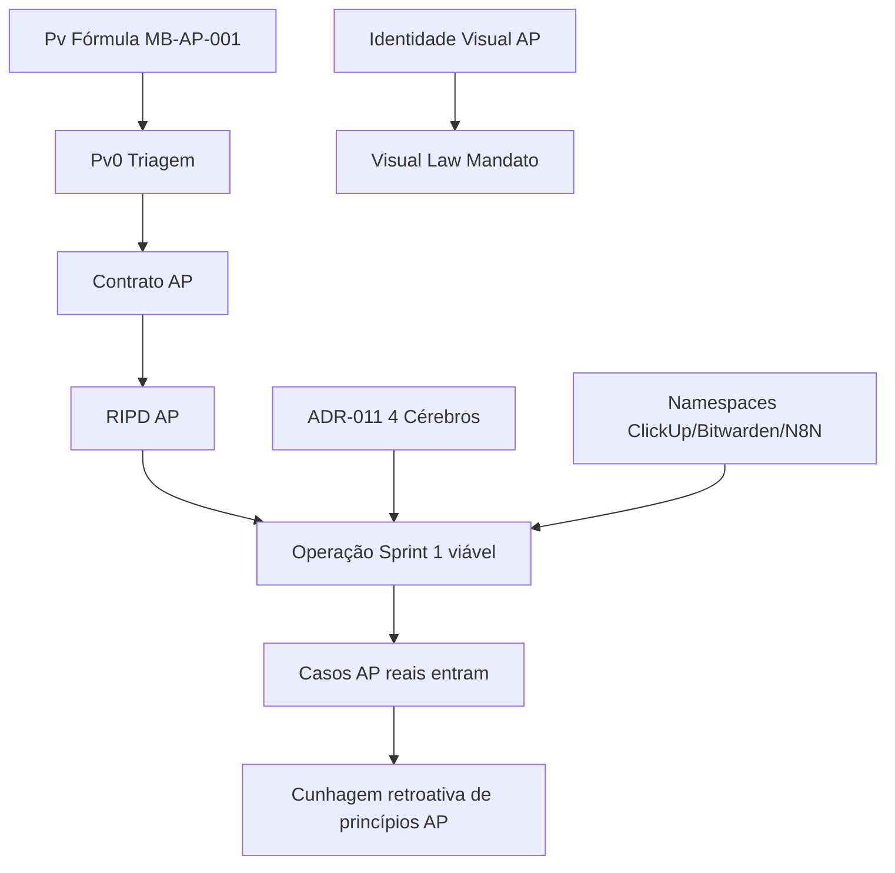

# AP-INVENTARIO-Indice-MasterMap v1.0

**20 de maio de 2026 · MB-AP-002 · Tarefa 3 de 8 · Code DELL executor**

**Consolidação executiva do garimpo das 5 categorias do MB-AP-002**

---

## 1 · Sumário Executivo Consolidado

### 1.1 Totais

| Métrica | Valor |
|---|---|
| Arquivos `.md` varridos (Vault MC) | 356 (pós-skips) |
| Arquivos `.md` mapeados (Documentação) | 738 (amostragem para validar gaps) |
| **Total ativos lógicos catalogados (5 categorias)** | **111** |
| Ouros AP confirmados (passam 4 filtros) | **86** |
| Ativos descartados com nota | 25 |
| Lacunas detectadas (cunhagem AP do zero) | 31 |

### 1.2 Distribuição por categoria

| Categoria | Ativos catalogados | Ouro AP | % conversão |
|---|---:|---:|---:|
| **Grimório Previdenciário** | 12 (cap + changelog) | 8 | 67% |
| **Router-Ethics + Princípios + Hooks** | 42 (13 R + 24 P + 5 H) | 35 | 83% |
| **POPs & Templates** | 20 | 15 | 75% |
| **ADRs & Specs** | 17 | 13 | 76% |
| **Stack & Infraestrutura** | 18 | 15 | 83% |
| **Total** | 109 (+2 cross-ref) | 86 | 79% |

### 1.3 Distribuição por carimbo de conversão

| Carimbo | Quantidade | % | Implicação operacional |
|---|---:|---:|---|
| 🟢 CONVERSÃO ZERO | 41 | 48% | Reaproveitar sem adaptação narrativa |
| 🟡 CONVERSÃO LEVE | 24 | 28% | Vocabulário e tom — 0,5-2h por ativo |
| 🟠 CONVERSÃO MÉDIA | 16 | 19% | Reescrita de seções — 2-6h por ativo |
| 🔴 CONVERSÃO PROFUNDA | 5 | 6% | Refundação conceitual — 6-20h por ativo |

### 1.4 Esforço total estimado de conversão

| Sprint | Foco | Esforço | Entregáveis |
|---|---|---:|---|
| **Sprint 1 (30d)** | Conversão zero + leve (núcleo técnico) | **~30h** | Namespaces + 24 princípios adotados + ADRs herdados + POPs universais |
| **Sprint 2 (60d)** | Conversão média (re-narrativa) | **~50h** | Contrato AP + RIPD AP + Visual Law Mandato + 4 Cérebros + POPs Phi0→Pv0 + E1/E2 AP |
| **Sprint 3 (90d)** | Refundação profunda + lacunas críticas | **~80h** | Router-Pv-AP + Cascata AP + Stack KYC/AML + AP-RIPD Sentinela |
| **Sprint 4+ (120d+)** | Lacunas remanescentes | **~50-100h** | RPPS, Previdência complementar, Identidade Visual AP, demais lacunas |
| **TOTAL** | | **~210-260h** | ≈ 26-32 dias de trabalho concentrado |

---

## 2 · TOP 20 OUROS AP (por valor estratégico)

| # | Ativo | Categoria | Carimbo | Por que TOP |
|---|---|---|---|---|
| **1** | **Grimório Cap 13.1 — Revisões de Benefícios (Vida Toda, Teto, Buraco Negro, Tempo Especial, DER Flex, Híbrida)** | Grimório | 🟠 | Ticket R$ 30K-200K retroativos = centro perfeito da Fórmula Pv. **Ouro AP de maior potencial financeiro.** |
| **2** | **3 Estados Custódia Dossiê S1/S2/S3 + TTA Tier 1 Guard (ADR-009b)** | RouterEthics + ADRs | 🟢 | Coluna vertebral do sigilo — ainda mais crítica em AP. |
| **3** | **Stack LLM Multi-Modelo v1.1 (GAIA + Sabiá + Bedrock + Groq + LiteLLM + Albertina)** | Stack & Infra | 🟢 | Infraestrutura completa herdada sem custo marginal. |
| **4** | **Complexity Score (C_comp) → input direto Cc da Fórmula Pv** | RouterEthics | 🟢 | Único ativo de matemática-pura transferível 1:1 para Pv. |
| **5** | **POP Visual Law DossieSelado PARTES 1+2+3 v1.3** | POPs | 🟠 | Estética + estrutura do dossiê premium concierge. Diferencial percebido pelo cliente alta-renda. |
| **6** | **Proof-First (Hash SHA-256 + RFC 3161 ICP-Brasil)** | RouterEthics | 🟢 | Auditabilidade jurídica — em AP exigência adversarial. |
| **7** | **Custódia gov.br Bitwarden (ADR-009a v2.0)** | RouterEthics + ADRs + Stack | 🟢 | Lei + ética + segurança em uma única política. |
| **8** | **Grimório Cap 4.9 — Pensão por Morte: 6 teses judiciais** | Grimório | 🟠 | Tempus regit actum + EC 103 acumulação — ROI alto para viúvas de empresários. |
| **9** | **ADR-016 Compliance Documental Anti-Injection (3 pilares)** | ADRs | 🟢 | Em AP, dossiê adversarial enfrenta tentativas de injection — defesa crítica. |
| **10** | **MC-CHANGELOG-Juridico v2.0 + estrutura (SLA 48h STF / 72h portarias / 24h+72h MPs)** | Grimório | 🟡 | Disciplina de atualização legislativa = produto recorrente "Inteligência Premium". |
| **11** | **Hook 0 gov.br Prata mínimo + Catálogo de Travas v1.1** | RouterEthics + Stack | 🟢 | Pré-flight universal INSS. |
| **12** | **Grimório Cap 13.2 — Defesa de Benefícios + Watchdog proativo** | Grimório | 🟠 | Cessação indevida = produto recorrente premium. |
| **13** | **24 Princípios Cofounder Universais (#1, 1b, 4-21 selecionados)** | RouterEthics | 🟢 | Governança operacional sem reescrita — herança imediata. |
| **14** | **MC-PROCESSO-Jornada E0E7 Mestre v1.3.1** | POPs | 🟠 | Mapa-mestre do processo cliente. |
| **15** | **Contrato Φ₁ MINUTA v2.4 (estrutura jurídica)** | POPs | 🟠 | 14 cláusulas refinadas em 8 meses de iteração — base para Contrato AP. |
| **16** | **Matriz 4 Camadas IA C1/C2/C3/C4 + Firewall LGPD (Princípio #21)** | Stack & Infra | 🟢 | Disciplina inviolável que protege dados sensíveis — vale mais em AP. |
| **17** | **POP E5 Watchdog Exigências v1.0** | POPs | 🟢 | SLA crítico para evitar indeferimentos por exigência não respondida. |
| **18** | **ADR-011 Arquitetura 3 Cérebros → 4 Cérebros AP** | ADRs | 🟡 | Topologia arquitetural canônica. |
| **19** | **Grimório Cap 4.3 — Aposentadoria Especial (insalubridade/periculosidade)** | Grimório | 🟠 | 94% judicializada em MC vira atendimento concierge direto em AP. ROI alto. |
| **20** | **MC-SPEC Playwright MeuINSS v1.0 (RPA automação)** | ADRs/Specs + Stack | 🟢 | Automação INSS neutra à persona. |

---

## 3 · Mapa de Pendências de Conversão

### 3.1 Por categoria × esforço

```
                          ZERO  LEVE  MÉDIA  PROFUNDA  TOTAL
GRIMÓRIO                    0     1     4      3        8 ouros
ROUTER-ETHICS + PRINCÍPIOS 21     6     1      1       29 ouros (parte de 35; demais cross-ref)
POPs & TEMPLATES            5     4     5      1       15 ouros
ADRs & SPECS                7     4     2      0       13 ouros
STACK & INFRA              11     3     1      0       15 ouros
─────────────────────────────────────────────────────────
TOTAIS                     44    18    13      5       80 ouros (descontando cross-refs)
```

(Pequenas diferenças vs §1.2 devido a cross-references contadas uma vez no tema "principal".)

### 3.2 Horizonte temporal sugerido

```
HOJE      30d         60d         90d         120d+
│          │           │           │            │
├── Sprint 1 (30h)
│         ZERO + LEVE + namespaces
│
│          ├── Sprint 2 (50h)
│          │            MÉDIA: Contrato AP, RIPDs, Visual Law,
│          │            4 Cérebros, Pv0 Triagem, E1/E2 AP
│
│                       ├── Sprint 3 (80h)
│                       │            PROFUNDA: Router-Pv-AP, Cascata AP,
│                       │            Stack KYC/AML, AP-RIPD Sentinela
│
│                                    ├── Sprint 4+ (50-100h)
│                                    │     Lacunas: RPPS, Complementar, Marca AP,
│                                    │     Tributação previdenciária empresarial
```

### 3.3 Dependências críticas (caminho crítico)



**Bloqueadores críticos para iniciar AP-operação:**
1. **Contrato AP-Mandato-Concierge v1.0** (~10h cunhagem + revisão Dra. Juliana) — sem ele, AP não fecha caso 1.
2. **RIPD AP** (~5-8h) — sem ele, ANPD pode autuar.
3. **Cascata AP (Compliance > Sigilo > Pv)** (~8h) — sem ela, AP pode aceitar caso eticamente comprometido.
4. **Namespaces operacionais** (~5h) — sem eles, dados AP misturam-se a dados MC (violação Princípio #21).

**Tempo mínimo para AP estar pronto para o primeiro caso real: ~28-30h** (assumindo trabalho focado, sem interrupções).

---

## 4 · Roadmap de Implementação Sugerido

### Sprint 1 (D+1 a D+30) · "Fundação Mínima Viável" · 30h

**Objetivo:** AP fecha primeiro caso real ao final do sprint.

**Cunhagens:**
1. `AP-CONTRATO-Mandato-Concierge-v1_0-2026-XXXX.md` (8-10h) — espelho estrutural Φ₁ + Pv pricing + sigilo reforçado. **GATE: revisão Dra. Juliana ou advogado AP-específico.**
2. `AP-RIPD-Mandato-Concierge-v0_1-PROVISIONAL.md` (5-8h) — espelho RIPD Φ₁ Fase 1.
3. `AP-POP-Pv0-Triagem-Operacional-v1_0.md` (4-6h) — espelho POP Phi0 com perguntas AP-específicas.
4. `AP-POP-E1-PrimeiroContato-Mandato-v1_0.md` (3-4h)
5. `AP-POP-E2-Pv-Deliberacao-v1_0.md` (4-5h)
6. `AP-ADR-001-Arquitetura4Cerebros-v1_0.md` (2-3h)

**Adoções por referência (zero conversão):**
- ADR-008, 009a, 009b, 010, 012, 014, 016, 019 (8 ADRs adotados como compartilhados)
- 24 princípios cofounder universais (R14-R37)
- POPs E3-E6 + Bitwarden + Encerramento + Desbloqueio gov.br (8 POPs)
- Stack LLM completa + Hostinger + ClickUp + N8N + MCPs (S1-S8, S14, S18)

**Tarefas operacionais (~5h):**
- Criar Space ClickUp `Alessandro Premium`
- Criar coleção Bitwarden `AP/`
- Criar projeto Coolify `ap-workflows`
- Configurar daemon de sync ClickUp → Vault

**Critério de sucesso Sprint 1:** Caso âncora PED002 (já cunhado em AP-CASO-TEMPLATE-PED002) ou outro caso real fechado sob Contrato AP-Mandato.

---

### Sprint 2 (D+31 a D+60) · "Diferencial Concierge" · 50h

**Objetivo:** AP entrega dossiê premium com identidade visual diferenciada + opera 5-10 casos paralelos.

**Cunhagens:**
1. `AP-POP-MandatoEstrategico-Concierge-PARTE1+2+3-v1_0.md` (8-12h) — espelho Visual Law DossieSelado v1.3.
2. `AP-PROCESSO-Jornada-Mandato-v1_0.md` (5-8h) — espelho Jornada E0E7 com SLAs AP-específicos.
3. `AP-POP-Handoff-Contencioso-v1_0.md` (4-6h) — protocolo de sub-contratação de advogado parceiro AP.
4. `AP-ADR-002-FeaturesAvancadas-ClickUp-Space-AP-v1_0.md` (2-3h)
5. `AP-SPEC-ClickUp-CustomFields-v1_0.md` (4-6h)
6. `AP-CHANGELOG-Juridico-v1_0.md` (2-3h, espelha estrutura + curadoria inicial AP)
7. `AP-INVENTARIO-Grimório` (esta missão já produziu — material vivo)
8. Workflows N8N AP-específicos (~10h)

**Adoções incrementais:**
- Anexo B Base Legal (com adição de RPPS/Complementar/Magistrados)
- Templates TTA + Manifesto + Troca Senha (3 templates)

**Critério de sucesso Sprint 2:** Primeira entrega de dossiê concierge AP com selo "ALESSANDRO PREMIUM" e Visual Law Mandato.

---

### Sprint 3 (D+61 a D+90) · "Refundação Conceitual" · 80h

**Objetivo:** AP tem motor próprio de qualificação (não depende mais de re-leitura mental do Router-Ethics MC).

**Cunhagens profundas:**
1. **Router-Pv-AP** (10-15h) — motor de qualificação substituto, integrando Pv + cascata AP.
2. **AP-ADR-003 Stack KYC/AML + Fraudscore AP** (15-20h) — implementação completa.
3. **AP-Cascata Compliance > Sigilo > Pv** (8-12h) — filosofia inviolável AP.
4. **AP-RIPD-Sentinela-Concierge-v0_1-PROVISIONAL** (4-6h) — RIPD do produto recorrente.
5. **AP-INSTRUCOES-Operacionais-v2_0** (5-8h) — consolidação das Sprints 1-2.

**Mudanças do Grimório embarcadas:**
- Cap 13.1 (Revisões) virou `AP-TESES-Revisao-v1_0` (8-12h)
- Cap 4.9 (Pensão por Morte 6 teses) virou `AP-TESES-PensaoMorte-v1_0` (4-6h)
- Cap 4.3 (Aposentadoria Especial) virou `AP-TESES-AposentadoriaEspecial-v1_0` (3-5h)
- Cap 13.2 (Defesa) virou `AP-PROTOCOLO-Defesa-Cessacao-v1_0` (4-6h)

**Critério de sucesso Sprint 3:** AP opera 15-30 casos paralelos com motor próprio + 4 teses específicas catalogadas.

---

### Sprint 4+ (D+91+) · "Cobertura de Lacunas" · 50-100h

**Cunhagens novas (sem base MC):**
1. **AP-GRIMORIO-RPPS-Servidores** (Lei 8.112, EC 41, EC 47, magistrados, militares) — 15-25h
2. **AP-GRIMORIO-Previdencia-Complementar** (PGBL/VGBL, RPC Lei 12.618) — 10-15h
3. **AP-GRIMORIO-Tributacao-Previdenciaria-Empresarial** (CPRB, contribuição patronal majorada, autuações Receita) — 10-15h
4. **AP-MARCA-Identidade-Visual-v1_0** (logo, papelaria, slide deck) — 20-30h (sprint dedicada com Adobe/Figma)
5. **AP-CANAL-Comunicacao-Cliente-v1_0** (Calendly + email signature + Zoom config) — 5-8h

---

## 5 · Lacunas Críticas (AP precisa cunhar do zero)

### 5.1 Lacunas jurídicas (alta prioridade)

| Lacuna | Por que crítica | Sprint sugerida |
|---|---|---:|
| **RPPS Servidores (Lei 8.112, EC 41, EC 47, magistrados, militares)** | AP atende ex-servidores públicos federais/estaduais/municipais de alto escalão com regras próprias. Grimório só cobre RGPS. | Sprint 4 |
| **Previdência complementar privada (PGBL/VGBL)** | Otimização tributária previdenciária — ZERO no Grimório. Cliente alta-renda quase sempre tem complementar privada. | Sprint 4 |
| **RPC Pública (Lei 12.618 Funpresp)** | Pós-reforma 2013, executivos públicos têm RPC. | Sprint 4 |
| **Tributação previdenciária empresarial (CPRB, contribuição patronal, NFLD)** | AP atende empresário-cliente em autuações previdenciárias. | Sprint 4 |
| **Aposentadoria de magistrados (LC 35/79, EC 88/2015)** | Regra própria com transição. | Sprint 5 |
| **Acordos previdenciários internacionais (Portugal, Itália, Espanha, EUA, etc.)** | Profissional liberal com trabalho no exterior. | Sprint 5 |

### 5.2 Lacunas operacionais (média prioridade)

| Lacuna | Categoria |
|---|---|
| AP-POP-Onboarding-Presencial-Calendly | POPs |
| AP-POP-Apresentacao-Pv-ao-Cliente | POPs |
| AP-POP-Negociacao-Pv | POPs |
| AP-POP-Comunicacao-Escritorio-Contabilidade-Cliente | POPs |
| AP-POP-Comunicacao-Escritorio-Juridico-Tributario-Cliente | POPs |
| AP-POP-Audiencia-Pericia-Presencial | POPs |
| AP-Contrato-NDA-Cruzado | Contratos |
| AP-RIPD-Dados-Patrimoniais-Sensiveis | RIPDs |

### 5.3 Lacunas tecnológicas (baixa-média prioridade)

| Lacuna | Stack |
|---|---|
| Stack KYC/AML (PEP, OFAC, listas restritivas) | Crítica para Fraudscore AP |
| Backup encriptado offline para dossiês AP | Cliente premium pode exigir |
| Monitoramento performance LLM por persona AP | Métricas separadas |
| Canal Calendly + email signature + Zoom config | Substituir WhatsApp como canal principal |

### 5.4 Lacunas estratégicas (definir antes de operar em volume)

| Lacuna | Pergunta a responder |
|---|---|
| **AP é PF, ME, LTDA ou outra estrutura?** | Define contrato + tributação + responsabilidade |
| **AP financia capacidade MC (Inversão Cósmica invertida)?** | Define propósito AP além de receita |
| **Dra. Juliana atende AP ou contrata-se outro advogado parceiro?** | Define gate jurídico das cunhagens AP |
| **Pasta `RIO/` vazia: AP terá vertical regional?** | Anomalia detectada no sweep |
| **MC-INSTRUCOES v8.0.1 17/05 não está no Vault — está em outra fonte?** | Memória aponta como vigente mas não detectada |

---

## 6 · Anomalias do Vault MC (detectadas durante sweep) · ação recomendada pós-AP

| Anomalia | Ação sugerida |
|---|---|
| 6 arquivos `.bak` no root do Vault | Mover para `_HISTORICO/` |
| Duplicação Grimório v2 (2 arquivos quase idênticos) | Confirmar canônico, mover outro para `_arquivados/` |
| ADRs 007/008/009a/010/013 em 02 e 03 | Princípio #24 deve resolver; agendar housekeeping |
| Router-Ethics v10 sem mover para `_arquivados/` | Mover |
| RIPDs com sufixo `ERRATADO-tamanho-incompleto` | Mover para `_arquivados/` |
| POP Visual Law duplicado entre `pops/` e `protocolos/` | Mover `pops/` para `_arquivados/` |
| INDEX.md desatualizado (cita `06-OPERACOES`, falta `01-IDENTIDADE`, `06-COMUNICACAO`, `JURIDICO`, `04-OPERACAO`) | Atualizar INDEX.md v2.0 |
| Pasta `RIO/` vazia | Decidir propósito ou remover |
| Pasta `Documentação/` (interna ao Vault) | Resíduo de migração — mover ou consolidar |

**Estas anomalias NÃO bloqueiam AP, apenas geram dívida de housekeeping MC.**

---

## 7 · Veredito Estratégico

### 7.1 O que o Vault MC entrega para AP

- **86 ouros** confirmados — material reaproveitável em escala industrial.
- **41 ativos com conversão zero** — herança gratuita imediata.
- **Stack tecnológica completa funcional** — sem custo marginal de infraestrutura.
- **24 princípios cofounder universais** — disciplina operacional madura.
- **Estrutura jurídica refinada** (Contratos + RIPDs + ADRs) — 8 meses de iteração.
- **Casos âncora reais** (Hib001, MC-PACOTE-Juliana) — playbooks empíricos.

### 7.2 O que o Vault MC NÃO cobre para AP

- **Universo RPPS** (servidores públicos, magistrados, militares) — público AP relevante.
- **Previdência complementar privada** (PGBL/VGBL) — eixo de otimização tributária AP.
- **Tributação previdenciária empresarial** — clientes empresariais.
- **Stack KYC/AML** — crítico para Fraudscore AP.
- **Identidade visual AP-própria** — sprint dedicada futura.
- **Canal de comunicação não-WhatsApp** — Calendly + Zoom + email signature.

### 7.3 Tempo realista para AP estar operacional

| Marco | Esforço acumulado | Prazo realista (founder + Code) |
|---|---:|---|
| **AP fecha 1º caso real** | ~30h | 2-3 semanas |
| **AP entrega dossiê premium com Visual Law Mandato** | ~80h | 6-8 semanas |
| **AP opera 15-30 casos paralelos com motor próprio** | ~160h | 12-14 semanas |
| **AP cobre todas as lacunas (RPPS + Complementar + Tributação)** | ~250-300h | 22-28 semanas |

### 7.4 Recomendação ao founder

1. **Não tente cunhar tudo em paralelo.** O caminho crítico é claro: Contrato → RIPD → Pv0 Triagem → 4 Cérebros → Namespaces. Esses 5 ativos liberam o primeiro caso real.
2. **Dra. Juliana Pereira de Melo (OAB-GO 38.662) deve ser o gate jurídico do Contrato AP.** Se ela não atender AP por conflito de escopo, contratar outro advogado parceiro AP-específico ANTES de operar.
3. **AP herda 79% do MC sem reescrita conceitual.** A engenharia reversa funciona — não é caso de começar do zero.
4. **Sprint 4 (lacunas RPPS/Complementar/Tributação) é decisória para escalar AP além de revisões de RGPS.** Cliente high-net-worth tipicamente tem mistura RPPS + RGPS + Complementar. Sem cobertura tripla, AP fica limitado a um segmento estreito.
5. **A pasta `inventario-AP/` no Vault MC (onde estes 7 documentos vivem) pode permanecer aqui por 60-90 dias.** Depois disso, considerar migração para Vault AP separado quando o volume justificar (ADR-011 → 4 Cérebros AP).

---

## 8 · Cross-Reference Maps dos 7 Documentos

| Documento | Path canônico |
|---|---|
| **MB-AP-002 Sweep Diagnóstico** | `04-OPERACAO/logs/inventario-AP/MB-AP-002-SWEEP-DIAG-2026-0520.md` |
| **Inventário Grimório** | `04-OPERACAO/logs/inventario-AP/AP-INVENTARIO-Grimorio-v1_0-2026-0520.md` |
| **Inventário Router-Ethics** | `04-OPERACAO/logs/inventario-AP/AP-INVENTARIO-RouterEthics-v1_0-2026-0520.md` |
| **Inventário POPs & Templates** | `04-OPERACAO/logs/inventario-AP/AP-INVENTARIO-POPsTemplates-v1_0-2026-0520.md` |
| **Inventário ADRs & Specs** | `04-OPERACAO/logs/inventario-AP/AP-INVENTARIO-ADRsSpecs-v1_0-2026-0520.md` |
| **Inventário Stack & Infra** | `04-OPERACAO/logs/inventario-AP/AP-INVENTARIO-StackInfra-v1_0-2026-0520.md` |
| **Índice MasterMap (este documento)** | `04-OPERACAO/logs/inventario-AP/AP-INVENTARIO-Indice-MasterMap-v1_0-2026-0520.md` |

---

## 9 · Pendências [CONFIRMAR FOUNDER] consolidadas

(extraídas dos 5 documentos temáticos)

1. **Estrutura jurídica AP:** PF, ME, LTDA, outra? (T2.3 P15)
2. **Dra. Juliana atende AP, ou contrata-se outro advogado?** (T2.3 P15, P16, P17)
3. **AP financia capacidade MC (Inversão Cósmica invertida)?** (T2.2 lacuna)
4. **Cliente AP precisa ter gov.br próprio, ou pode delegar 100% via mandato?** (T2.2 R8)
5. **Vault AP separado ou namespace dentro do Vault MC?** (T2.4 A5)
6. **Tema 1.102/STF (Vida Toda) — situação atualizada 05/2026 pós-modulação** (T2.1 Ativo 01)
7. **Pasta `RIO/` vazia — propósito?** (T1 anomalia §3.18)
8. **MC-INSTRUCOES v8.0.1 (memória aponta vigente 17/05) — está em outra fonte?** (T1 anomalia §3.15)
9. **Duplicação Grimório v2 — qual canônico?** (T1 anomalia §3.2)
10. **Duplicação ADR 02 vs 03 — qual pasta canônica?** (T1 anomalia §3.3)

---

**AP-INVENTARIO-Indice-MasterMap v1.0 · SELADO 20/05/2026**
Executor: Claude Code DELL · MB-AP-002 · Tarefa 3 de 8 concluída
∞
