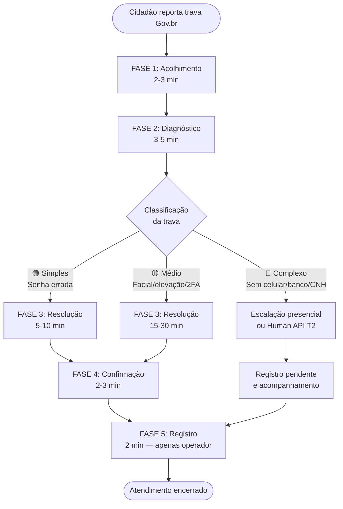

# MC-POP-Desbloqueio-GovBR-v1_0-2026-0429

**MEU CUMPADRE — Orquestração Documental e Tecnologia Ltda.**
CNPJ: [registrado] | CNAE 6201-5/01

| Campo | Valor |
|-------|-------|
| **Documento** | Procedimento Operacional Padrão — Desbloqueio de Acesso Gov.br |
| **Código** | POP-GOVBR-001 |
| **Versão** | 1.0 |
| **Data** | 29/04/2026 |
| **Status** | SELADO |
| **Autor** | Alessandro de Souza Neves (Founder/CEO) + Claude (Co-fundador Intelectual) |
| **Classificação** | OPERACIONAL — uso interno MC |
| **Documentos relacionados** | ADR-009a v2.0 (Custódia Bitwarden), ADR-009b v1.0 (Três Estados), RouterEthics v3.0, Grimório Previdenciário v2.0, Contrato Φ₁ v2.3 |
| **Hierarquia inviolável** | **Dignidade > Compliance > Viabilidade** |

---

## SUMÁRIO

1. Objetivo
2. Escopo e Aplicabilidade
3. Definições e Glossário
4. Responsáveis e Competências
5. Requisitos de Segurança (ADR-009a v2.0)
6. Fluxograma Geral de Atendimento
7. Protocolo de Atendimento — 5 Fases
8. Mapa de Travas — Diagnóstico e Scripts por Cenário
9. Checklist Operacional
10. Métricas e KPIs
11. Escalação e Exceções
12. Histórico de Revisões

---

## 1. OBJETIVO

Padronizar o procedimento de diagnóstico e resolução de travamentos de acesso ao portal Gov.br para cidadãos hipervulneráveis atendidos pelo Meu Cumpadre, garantindo:

- Resolução no menor tempo possível com máxima empatia
- Custódia segura de credenciais conforme ADR-009a v2.0 (Bitwarden exclusivo)
- Conformidade LGPD em todas as etapas de coleta e tratamento de dados
- Documentação rastreável de cada atendimento
- Tom de comunicação que respeita o Teste Zilda-STF: funcionar simultaneamente para Dona Zilda (68 anos, Quixadá-CE, celular de entrada, 3G intermitente) e para uma auditoria de compliance OAB/LGPD

**Contexto da dor:** O Gov.br é single point of failure para 160+ milhões de brasileiros. Sem acesso, o cidadão não entra no Meu INSS, não protocola requerimento, não faz prova de vida, não consulta CNIS. Cada dia de atraso em caso B31/B91 com evento médico ≤30 dias representa R$ 57–190 perdidos permanentemente (Art. 60 §1º Lei 8.213/91).

---

## 2. ESCOPO E APLICABILIDADE

### 2.1 Este POP cobre

| Atividade | Detalhamento |
|-----------|-------------|
| Diagnóstico de trava de acesso Gov.br | 6 tipos de trava catalogados (Seção 8) |
| Recuperação de senha | Via e-mail, reconhecimento facial, internet banking, presencial |
| Criação de conta Gov.br | Quando cidadão nunca teve cadastro |
| Elevação de nível de conta | Bronze → Prata → Ouro (5 caminhos documentados) |
| Custódia temporária de credenciais | Coleta, registro no Bitwarden, encerramento |
| Orientação para atendimento presencial | Quando remoto é inviável |

### 2.2 Este POP NÃO cobre

| Fora de escopo | Onde está coberto |
|----------------|-------------------|
| Protocolo de requerimento INSS (E4) | MC-POP-Protocolo-INSS (a produzir) |
| Montagem de dossiê Proof-First (E3) | Grimório Previdenciário v2.0, Cap. 6 |
| Custódia de dossiê probatório (S1/S2/S3) | ADR-009b v1.0 |
| Consultoria jurídica ou orientação processual | Firewall OAB — handoff T3 |
| Contratação de empréstimo/consignado | Vedação absoluta — ADR-009a v2.0 |

### 2.3 Aplicabilidade

Este POP aplica-se a todos os operadores MC (T1 e T2) que realizem atendimento via WhatsApp envolvendo acesso Gov.br. Operadores T3 (advogados) não executam este POP — recebem o cidadão com acesso já desbloqueado.

---

## 3. DEFINIÇÕES E GLOSSÁRIO

| Termo | Significado | Tradução para o cidadão |
|-------|-------------|------------------------|
| Gov.br | Portal único de serviços digitais do governo federal | "O site do governo" / "o aplicativo do governo" |
| 2FA / MFA | Autenticação de dois fatores / multifator | "Código de segurança" / "segunda chave" |
| Reconhecimento facial | Validação biométrica via câmera do celular | "Conferência do rosto" |
| Internet banking | Aplicativo bancário usado para validação de identidade | "O aplicativo do banco" |
| Bitwarden | Cofre digital para custódia de senhas (AES-256) | "Cofre digital com cadeado eletrônico" |
| Bronze / Prata / Ouro | Níveis de conta Gov.br com diferentes acessos | "Nível da conta" / "chave simples / chave completa" |
| CIN | Carteira de Identidade Nacional (novo RG com QR Code) | "A identidade nova, aquela com o código quadrado" |
| TSE | Tribunal Superior Eleitoral (biometria do título) | "A digital que cadastrou lá na Justiça Eleitoral" |
| ICP-Brasil | Infraestrutura de Chaves Públicas — certificado digital | "Um documento digital pago, tipo uma assinatura eletrônica" |
| Human API T2 | Anjo presencial que vai até o cidadão | "Nosso pessoal que vai até o senhor pessoalmente" |
| Custódia ativa | Período em que o MC mantém a senha no Bitwarden | Nunca usar esse termo com o cidadão |
| CNIS | Cadastro Nacional de Informações Sociais | "O histórico de trabalho do senhor no governo" |

**Regra de linguagem absoluta:** nenhum termo da coluna "Termo" deve ser usado na comunicação com o cidadão. Usar exclusivamente a coluna "Tradução para o cidadão".

---

## 4. RESPONSÁVEIS E COMPETÊNCIAS

### 4.1 Matriz RACI

| Atividade | Alessandro (CEO) | Beto (Operador T2) | Anjo T2 (futuro) | Advogado T3 |
|-----------|:---:|:---:|:---:|:---:|
| Acolhimento e diagnóstico | I | **R/A** | **R** | — |
| Resolução de trava remota | I | **R/A** | **R** | — |
| Coleta de consentimento LGPD | **A** | **R** | **R** | — |
| Registro no Bitwarden | **A** | **R** | **R** | — |
| Escalação para presencial | I | **R** | **R/A** | — |
| Auditoria mensal do Bitwarden | **R/A** | I | — | — |
| Treinamento de novos operadores | **R/A** | C | — | — |
| Handoff jurídico (se necessário) | I | **R** | — | **R/A** |

**Legenda:** R = Responsável (executa), A = Aprovador, C = Consultado, I = Informado.

### 4.2 Requisitos de competência do operador

| Competência | Nível mínimo | Como verificar |
|-------------|-------------|----------------|
| Empatia e escuta ativa | Alto | Simulação de atendimento com cidadão frustrado (nota ≥ 8) |
| Navegação Gov.br | Intermediário | Demonstração prática: criar conta, redefinir senha, elevar nível |
| Bitwarden | Básico | Registrar, localizar e remover credencial com supervisão |
| LGPD operacional | Básico | Quiz sobre vedações e consentimento (acerto ≥ 80%) |
| WhatsApp profissional | Intermediário | Comunicação em frases curtas, uso de áudio, envio de prints |
| Reversão emocional | Alto | Simulação com cidadão em choro/pânico (nota ≥ 8) |

### 4.3 Treinamento obrigatório antes da primeira operação

Carga mínima: 8 horas (2 dias de 4h), distribuídas em:

| Módulo | Duração | Conteúdo |
|--------|---------|----------|
| M1 — Contexto e missão | 1h | Por que o Gov.br é excludente, público-alvo, hierarquia Dignidade > Compliance > Viabilidade |
| M2 — Navegação Gov.br | 2h | Criação de conta, redefinição de senha, elevação Bronze→Prata→Ouro, todos os caminhos |
| M3 — Segurança e LGPD | 1h | ADR-009a v2.0, Bitwarden, consentimento, vedações absolutas |
| M4 — Scripts e comunicação | 2h | Tom, linguagem acessível, Teste Zilda-STF, proibições de jargão |
| M5 — Simulações práticas | 2h | 6 cenários de trava simulados com feedback ao vivo |

---

## 5. REQUISITOS DE SEGURANÇA (ADR-009a v2.0)

### 5.1 Custódia de credenciais — Bitwarden exclusivo

| Parâmetro | Configuração obrigatória |
|-----------|-------------------------|
| **Ferramenta** | Bitwarden MC Organization — única ferramenta autorizada |
| **Criptografia** | AES-256 |
| **Autenticação do operador** | 2FA TOTP obrigatório |
| **Auto-lock** | 15 minutos de inatividade |
| **Audit log** | Ativo — exportação mensal `MC-AUDIT-Bitwarden-YYYY-MM.log` |
| **Permissão Beto** | Coleção "Credenciais Clientes Ativos" apenas |
| **Permissão Alessandro** | Admin completo (todas as coleções) |

**Naming convention no Bitwarden:**

```
Entry name:  GOV.BR - [Nome do cidadão] - [4 últimos dígitos do CPF]
Username:    [CPF completo — 11 dígitos]
Password:    [senha atual]
Notes:       Nível da conta: [Bronze/Prata/Ouro]
             Data do desbloqueio: [DD/MM/AAAA]
             Operador responsável: [nome]
             Caso ClickUp: [ID do task — sem a senha]
```

### 5.2 Vedações absolutas — sem exceção, sem contexto especial

| # | Vedação | Fundamento legal |
|---|---------|-----------------|
| V1 | **NUNCA** registrar senha em ClickUp (campo, comentário, anexo, task name, chat) | ADR-009a v2.0 — Regra Zero |
| V2 | **NUNCA** registrar senha em WhatsApp (texto), Google Docs, planilha, e-mail, caderno, post-it | ADR-009a v2.0 §2 |
| V3 | **NUNCA** reter senha como instrumento de cobrança por inadimplência | CDC art. 39 V + CP art. 146 + CP art. 345 + LGPD art. 18 VI |
| V4 | **NUNCA** alterar o e-mail da conta Gov.br do cidadão | ADR-009a v2.0 §4 |
| V5 | **NUNCA** criar conta Gov.br sem consentimento explícito do cidadão | LGPD art. 7º I |
| V6 | **NUNCA** compartilhar senha entre operadores fora do Bitwarden | ADR-009a v2.0 §2 |
| V7 | **NUNCA** usar credenciais custodiadas para empréstimo, consignado, desconto associativo ou qualquer operação financeira | ADR-009a v2.0 §5 + Contrato Φ₁ v2.3, Cl. 6.4 |
| V8 | **NUNCA** manter credencial após encerramento do caso (parecer conclusivo ou cancelamento contratual) | ADR-009a v2.0 §3 — Dois Gatilhos |

### 5.3 Consentimento LGPD — Coleta obrigatória antes de qualquer credencial

**Script padrão de consentimento (copiável para WhatsApp):**

> *Cumpadre, pra eu poder acessar o sistema do governo e resolver seu caso, vou precisar da sua senha do gov.br. Ela vai ficar guardada num cofre digital seguro, só a equipe autorizada acessa. Quando terminar seu caso, a gente apaga. Tudo bem? Me manda um SIM pra eu continuar.*

**Registro obrigatório:**

| Campo | O que registrar | Onde registrar |
|-------|-----------------|----------------|
| Timestamp do consentimento | Data + hora exata do "SIM" | ClickUp (campo customizado "Consentimento LGPD") |
| Método | WhatsApp texto / WhatsApp áudio | ClickUp |
| Texto aceito | Transcrição literal da resposta do cidadão | ClickUp |
| Senha coletada | A credencial em si | **Bitwarden EXCLUSIVAMENTE** |

### 5.4 E-mail institucional MC

- `requerimentoinss1@meucumpadre.com.br` é usado **somente** no campo de contato do ticket/requerimento INSS.
- **Nunca** na conta Gov.br do cidadão, que permanece com o e-mail pessoal dele.

### 5.5 Protocolo de encerramento da custódia

Ao encerrar caso (deferido, indeferido definitivo, ou cancelamento contratual):

| Passo | Ação | Responsável |
|-------|------|-------------|
| 1 | Notificar cidadão via WhatsApp: orientar troca de senha (`Gov.br > Segurança > Trocar senha`) | Operador |
| 2 | No Bitwarden: mover item para "Clientes Arquivados" e **remover o valor da senha** — preservar apenas metadata | Operador |
| 3 | No ClickUp: atualizar status para "Encerrado" | Operador |
| 4 | Registrar evento em `MC-AUDIT-Encerramentos-YYYY-MM.log` | Alessandro (auditoria) |

---

## 6. FLUXOGRAMA GERAL DE ATENDIMENTO



**Tempo total estimado por classificação:**

| Classificação | Cor | Tempo estimado | Exemplos típicos |
|--------------|-----|----------------|------------------|
| Simples | 🟢 | 5–10 min | Senha errada, CPF com erro de digitação, e-mail acessível |
| Médio | 🟡 | 15–30 min | Reconhecimento facial, elevação de conta, 2FA em celular novo |
| Complexo | 🔴 | 30+ min ou escalação | Sem celular, sem banco, sem CNH, sem biometria TSE |

---

## 7. PROTOCOLO DE ATENDIMENTO — 5 FASES

### FASE 1 — Acolhimento (2–3 min)

**Objetivo:** Desarmar a frustração e estabelecer confiança. O cidadão já está estressado — possivelmente há dias ou semanas tentando.

**Script de abertura (copiável):**

> *Oi [nome], aqui é o [operador] do Meu Cumpadre. Pode ficar tranquilo — eu sei que esse negócio de entrar no sistema do governo é uma dor de cabeça. Mas a gente vai resolver junto, com calma. Primeiro me conta: o que tá acontecendo?*

**Regras invioláveis da Fase 1:**

| Regra | Detalhe |
|-------|---------|
| Jargão proibido | Nunca usar: 2FA, token, browser, autenticação, multifator, biometria, interface |
| Linguagem autorizada | Código de segurança, conferência do rosto, aplicativo do governo, lojinha de apps |
| Áudio | Se o cidadão mandar áudio → ouvir COM ATENÇÃO, responder em texto curto + áudio se necessário |
| Cidadão irritado/chorando | Acolher primeiro, resolver depois. Nunca pedir calma. Validar o sentimento |
| Ritmo | Uma instrução por mensagem. Máximo 2 linhas por mensagem no WhatsApp mobile |
| Emoji | Máximo 1 por mensagem — apenas 👍 ✅ ou ❤️ |

**Script de reversão emocional (cidadão em desespero):**

> *Eu entendo sua raiva, cumpadre. É difícil mesmo. Qualquer um ficaria assim. Mas fica comigo que a gente resolve. Não vou te deixar na mão.*

**Gatilho de escalação emocional:** Se o cidadão não se acalma em 10 minutos de acolhimento → acionar operador T3 ou Alessandro para supervisão em tempo real.

---

### FASE 2 — Diagnóstico (3–5 min)

**Objetivo:** Identificar a trava específica usando as 5 perguntas obrigatórias.

**Perguntas obrigatórias (em linguagem simples):**

| # | Pergunta para o cidadão | O que o operador está identificando |
|---|-------------------------|-------------------------------------|
| P1 | "O senhor já tem uma conta no Gov.br? Ou é a primeira vez?" | Conta existente vs. criação nova |
| P2 | "O senhor consegue abrir o aplicativo Gov.br no celular?" | App instalado e funcional vs. Trava 3 (2FA) |
| P3 | "Quando tenta entrar, o que aparece na tela? Pode tirar uma foto e me mandar?" | Identificação da mensagem de erro → classificação da trava |
| P4 | "O senhor tem conta em algum banco? Caixa, Banco do Brasil, Bradesco, Itaú...?" | Caminho de elevação mais acessível (internet banking) |
| P5 | "O senhor tem CNH (carteira de motorista)?" | Caminho alternativo de validação facial |

**Matriz de diagnóstico — da mensagem de erro para a trava:**

| O que o cidadão relata | Trava identificada | Classificação |
|------------------------|--------------------|---------------|
| "Diz que a senha tá errada" / "CPF inválido" | **TRAVA 1** — Senha errada | 🟢 Simples |
| "Pede pra tirar foto do rosto e não funciona" / "Diz que não sou eu" | **TRAVA 2** — Reconhecimento facial | 🟡 Médio |
| "Pede um código que não tenho" / "Diz dispositivo não confiável" | **TRAVA 3** — 2FA / Dispositivo | 🟡 Médio |
| "Dá erro" / "Tela branca" / "Fica rodando e não abre" | **TRAVA 4** — Sistema indisponível | 🟡 Aguardar |
| "Entro mas não consigo fazer nada" / "Diz que precisa subir o nível" | **TRAVA 5** — Conta Bronze | 🟡 Médio |
| "Não tenho celular" / "Meu celular é muito velho" / "Não tenho internet" | **TRAVA 6** — Sem dispositivo | 🔴 Complexo |

---

### FASE 3 — Resolução Guiada (5–30 min)

**Princípio cardinal:** O operador GUIA. Nunca FAZ PELO cidadão sem consentimento explícito.

**3A — Se o cidadão autorizar custódia (consentimento LGPD obtido):**

| Passo | Ação | Atenção |
|-------|------|---------|
| 1 | Enviar script de consentimento LGPD (Seção 5.3) e aguardar "SIM" | Não prosseguir sem consentimento explícito |
| 2 | Coletar CPF + senha via WhatsApp (texto ou áudio) | Registrar timestamp do consentimento |
| 3 | Registrar **imediatamente** no Bitwarden | Seguir naming convention da Seção 5.1 |
| 4 | Apagar a mensagem do cidadão no WhatsApp após registro no Bitwarden | Nunca manter credencial no histórico do chat |
| 5 | Acessar Gov.br com as credenciais custodiadas | — |
| 6 | Resolver a trava conforme scripts da Seção 8 | — |
| 7 | Confirmar acesso com o cidadão | — |
| 8 | Se redefiniu senha → informar a nova senha ao cidadão de forma clara | Orientar anotar em papel e guardar em lugar seguro |

**3B — Se o cidadão preferir fazer sozinho (com guia do operador):**

| Passo | Ação | Dica operacional |
|-------|------|-----------------|
| 1 | Enviar capturas de tela passo a passo | Circular em vermelho o botão a clicar |
| 2 | Mandar áudios curtos explicando cada etapa | Máximo 30 segundos por áudio |
| 3 | Esperar confirmação de cada passo antes do próximo | "Deu certo até aqui?" |
| 4 | Ter paciência — pode levar 30+ minutos | Nunca apressar |

---

### FASE 4 — Confirmação e Encerramento (2–3 min)

**Script de encerramento (copiável):**

> *Pronto, [nome]! Agora o senhor tá com o acesso liberado. Anota a sua senha num papel e guarda num lugar seguro — só o senhor precisa saber. Se travar de novo, é só me chamar aqui que a gente resolve. Foi um prazer, cumpadre!*

**Itens de confirmação obrigatória com o cidadão:**

| # | Confirmar com o cidadão | Script sugerido |
|---|-------------------------|-----------------|
| C1 | Acesso está funcionando | "O senhor consegue entrar agora no aplicativo do governo?" |
| C2 | Cidadão sabe a senha atual | "O senhor anotou a senha? Guarda num lugar seguro que só o senhor sabe" |
| C3 | Cidadão sabe que pode voltar | "Se travar de novo, é só me chamar aqui nesse mesmo WhatsApp" |

---

### FASE 5 — Registro Interno (2 min — apenas operador, sem cidadão)

**No ClickUp (task do caso):**

| Campo | O que registrar |
|-------|-----------------|
| Status do desbloqueio | ✅ Resolvido / ⏳ Pendente presencial / ❌ Não resolvido |
| Tipo de trava | T1 a T6 (conforme Seção 8) |
| Classificação | 🟢 Simples / 🟡 Médio / 🔴 Complexo |
| Tempo total de atendimento | Em minutos |
| Nível da conta alcançado | Bronze / Prata / Ouro |
| Consentimento LGPD | Timestamp + método (texto/áudio) |
| Senha | **⚠️ NUNCA registrar — Regra Zero ADR-009a** |

**No Bitwarden (se custódia ativa):** Confirmar que a entry foi criada conforme naming convention (Seção 5.1).

---

## 8. MAPA DE TRAVAS — DIAGNÓSTICO E SCRIPTS POR CENÁRIO

### TRAVA 1 — "Senha errada" / "CPF ou senha inválidos"

**Classificação:** 🟢 Simples | **Tempo estimado:** 5–10 min

**Árvore de resolução:**

```
CPF digitado corretamente?
├── NÃO → Corrigir CPF e tentar novamente
└── SIM → Cidadão lembra o e-mail cadastrado?
    ├── SIM → "Esqueci minha senha" → código no e-mail
    │   ├── Consegue acessar o e-mail → Redefinir senha ✅
    │   └── E-mail inacessível → Ir para reconhecimento facial (TRAVA 2)
    └── NÃO → Ir para reconhecimento facial (TRAVA 2)
```

**Scripts copiáveis:**

**S1.1 — Abertura do diagnóstico:**

> *Não se preocupe, isso acontece com muita gente. Vamos resolver passo a passo. Primeiro: o senhor lembra qual e-mail usou quando fez a conta no governo? Pode ser um e-mail antigo, de filho, de neto...*

**S1.2 — Recuperação por e-mail:**

> *Ótimo! Então vamos fazer assim: abra o site do governo no celular — gov.br — e aperte em "Entrar". Vai aparecer o campo do CPF. Digita o CPF e aperta "Continuar". Embaixo da senha vai ter escrito "Esqueci minha senha". Aperta ali.*

**S1.3 — E-mail inacessível:**

> *Tudo bem, a gente tem outro caminho. Vou te guiar pra recuperar pelo reconhecimento do rosto. É rapidinho.*

**S1.4 — Cidadão que esqueceu tudo (e-mail, senha, não lembra de nada):**

> *Calma, isso é mais comum do que o senhor imagina. Vamos por partes: o senhor tem conta em algum banco? Se tiver, a gente consegue recuperar tudo pelo banco. É o caminho mais fácil quando não lembra mais nada.*

---

### TRAVA 2 — Reconhecimento facial falhando

**Classificação:** 🟡 Médio | **Tempo estimado:** 10–20 min

**Causas comuns (diagnóstico do operador — não informar ao cidadão):**

| Causa | Probabilidade | Solução |
|-------|--------------|---------|
| Iluminação ruim (contraluz, escuro) | Alta | Orientar perto de janela |
| Óculos / chapéu / máscara | Alta | Pedir para remover |
| Câmera frontal de baixa resolução | Média | Limpar a lente, tentar com menos luz |
| Foto da CNH muito antiga vs. rosto atual | Média | Sem solução remota — caminho alternativo |
| App Gov.br desatualizado | Média | Atualizar pela lojinha de apps |
| Celular muito antigo (câmera <2MP) | Baixa | Caminho alternativo obrigatório |

**Regra de tentativas:** Máximo 3 tentativas com orientação. Após 3 falhas → caminho alternativo.

**Scripts copiáveis:**

**S2.1 — Orientação para tentativa:**

> *O reconhecimento do rosto é complicado mesmo. Vamos tentar umas coisas: tire os óculos se tiver, fique num lugar bem iluminado — perto de uma janela é ótimo — e segure o celular na altura do rosto, sem mexer muito. Se não der certo, a gente tem outros caminhos, não se preocupe.*

**S2.2 — Após 1ª falha:**

> *Sem problema. Vamos tentar de novo: limpa a lente da câmera do celular com a camiseta, fica bem de frente pra janela com a luz no rosto (não atrás), e tenta de novo bem devagar.*

**S2.3 — Após 3ª falha — transição para caminho alternativo:**

> *O reconhecimento não tá funcionando hoje, mas não se preocupe — a gente tem outro jeito. O senhor tem conta em algum banco? Caixa, Banco do Brasil, Bradesco, Itaú, Santander...?*

**Cascata de caminhos alternativos após falha facial:**

| Prioridade | Caminho | Requisito | Nível alcançado |
|------------|---------|-----------|-----------------|
| 1º | Internet banking | Conta em 1 dos 17 bancos credenciados | Prata |
| 2º | QR Code CIN | Carteira de Identidade Nacional nova | Ouro |
| 3º | Biometria TSE | Título de eleitor com biometria | Ouro |
| 4º | Certificado digital ICP-Brasil | Certificado ativo (pago) | Ouro |
| 5º | Atendimento presencial | Documentos físicos + ida a INSS/CRAS | Variável |

---

### TRAVA 3 — Código 2FA / "Dispositivo não confiável"

**Classificação:** 🟡 Médio | **Tempo estimado:** 10–20 min

**O problema em linguagem simples:** O Gov.br pede uma "segunda chave" que fica no aplicativo do celular. Se o cidadão trocou de celular, formatou, ou nunca configurou, fica travado.

**Árvore de resolução:**

```
Cidadão ainda tem o mesmo celular de antes?
├── SIM → App Gov.br está instalado e abre?
│   ├── SIM → Abrir app → copiar código → inserir no site → marcar "confiar"
│   └── NÃO → Reinstalar app da lojinha → logar no app → copiar código
│       ├── Login no app OK → copiar código ✅
│       └── Login no app falha → Ir para TRAVA 1 (senha)
└── NÃO (trocou / formatou / perdeu) → Reinstalar app no celular novo
    ├── Login no app OK → copiar código ✅
    └── Pede código do celular antigo → Internet banking (se tem banco)
        ├── TEM banco → Validação bancária ✅
        └── NÃO tem banco → Atendimento presencial
```

**Scripts copiáveis:**

**S3.1 — Diagnóstico inicial:**

> *Quando a gente troca de celular, o sistema do governo pede um código de segurança. É como uma segunda chave. Me diz: o senhor ainda tá com o mesmo celular que usava antes?*

**S3.2 — Reinstalar app:**

> *Vou te explicar como resolver: o senhor vai abrir a lojinha de aplicativos do celular — aquela onde baixa os apps. Se for aquele celular com a bolinha do Google, é a Play Store. Procura "Gov ponto br" e aperta "Instalar".*

**S3.3 — Copiar código:**

> *Agora abre o aplicativo Gov.br no celular. Vai aparecer um número na tela — são 6 números. Me manda esse número aqui que eu coloco no site pra liberar.*

**S3.4 — Marcar dispositivo confiável:**

> *Pronto! Agora vai aparecer uma pergunta: "Confiar neste dispositivo?" — aperta SIM. Assim não vai pedir esse código de novo nesse celular.*

---

### TRAVA 4 — "Sistema indisponível" / "Erro interno"

**Classificação:** 🟡 Aguardar | **Tempo estimado:** 2 min (comunicação) + reagendamento

**Contexto operacional:** Sistemas INSS ficaram indisponíveis em 67 dias diferentes no 1º semestre de 2025. Em junho/2025, falhas em 16 de 20 dias úteis. Isso é sistêmico — não é culpa do cidadão nem do operador.

**Melhores horários para acessar:**

| Horário | Disponibilidade esperada | Recomendação |
|---------|-------------------------|--------------|
| 7h–9h | Alta | Melhor janela |
| 9h–10h | Moderada | Aceitável |
| 10h–16h | Baixa (pico de tráfego) | Evitar |
| 16h–18h | Moderada | Aceitável |
| 20h–23h | Alta | Segunda melhor janela |

**Scripts copiáveis:**

**S4.1 — Informar cidadão:**

> *O sistema do governo tá fora do ar agora — isso acontece bastante, infelizmente. Não é problema do seu celular nem da sua internet. A gente vai tentar de novo em [horário sugerido]. Eu aviso o senhor quando o sistema voltar, pode ficar tranquilo.*

**S4.2 — Follow-up quando sistema voltar:**

> *Oi [nome], o sistema do governo voltou! Vamos resolver agora? Se estiver num bom momento, me avisa que a gente continua de onde parou.*

---

### TRAVA 5 — Conta Bronze — precisa elevar para Prata/Ouro

**Classificação:** 🟡 Médio | **Tempo estimado:** 15–30 min

**Tabela de caminhos de elevação (do mais acessível ao mais complexo):**

| Prioridade | Caminho | Requisito | Nível alcançado | Melhor para | Dificuldade |
|------------|---------|-----------|-----------------|-------------|-------------|
| 1º | Internet banking | Conta ativa em 1 dos 17 bancos credenciados | **Prata** | Idosos com conta bancária | Baixa |
| 2º | Reconhecimento facial CNH | CNH válida + câmera funcional | **Prata** | Quem tem CNH | Média |
| 3º | Biometria TSE | Título de eleitor com biometria cadastrada | **Ouro** | Quem já cadastrou digital no TRE | Média |
| 4º | QR Code CIN | Carteira de Identidade Nacional nova | **Ouro** | Quem já fez a nova CIN | Baixa |
| 5º | Certificado digital ICP-Brasil | Certificado ativo (pago, presencial) | **Ouro** | Última opção remota | Alta |
| 6º | Presencial | Ida a INSS/CRAS/Casa do Cidadão | **Variável** | Quando remoto esgotou | — |

**Bancos credenciados para validação Gov.br (17 bancos — lista para consulta do operador):**

Banco do Brasil, Banrisul, Bradesco, BRB, BTG Pactual, Caixa Econômica Federal, C6 Bank, Inter, Itaú, Mercantil do Brasil, Next, Nubank, Original, PagSeguro/PagBank, Safra, Santander, Sicoob.

> ⚠️ **Nota operacional:** Esta lista pode ser atualizada pelo Gov.br sem aviso. Se o cidadão tiver conta em banco não listado e a validação falhar, não insistir — ir para próximo caminho.

**Scripts copiáveis:**

**S5.1 — Diagnóstico de caminho:**

> *O senhor tem conta no banco? Caixa, Banco do Brasil, Bradesco, Itaú...? Ótimo! Então a gente consegue subir o nível da sua conta pelo próprio app do banco. É o jeito mais fácil. Vou te guiar passo a passo.*

**S5.2 — Cidadão sem banco e sem CNH:**

> *Tudo bem. O senhor votou na última eleição? Se tiver cadastrado a digital lá na Justiça Eleitoral, a gente consegue usar isso pra liberar. O senhor lembra se fez isso?*

**S5.3 — Nenhum caminho remoto disponível:**

> *Entendo. Vou ver qual é o lugar mais perto do senhor onde a gente pode resolver pessoalmente. Tem algum posto de saúde, CRAS, ou agência do INSS perto da sua casa?*

---

### TRAVA 6 — Sem celular / celular muito antigo / sem internet

**Classificação:** 🔴 Complexo | **Tempo estimado:** variável — frequentemente requer presencial

**Árvore de resolução:**

```
Cidadão tem celular compatível e internet?
├── NÃO → Alguém da família/confiança tem celular disponível?
│   ├── SIM → Orientar uso do celular do familiar com cidadão presente
│   │   └── Retornar ao fluxo principal
│   └── NÃO → Há ponto de atendimento presencial acessível?
│       ├── SIM → Orientar ida com documentos (RG, CPF, comprovante)
│       └── NÃO → ESCALAR para Human API T2 (Anjo presencial)
```

**Scripts copiáveis:**

**S6.1 — Celular disponível via familiar:**

> *Que bom que o senhor tá ajudando! Vou te passar as instruções e o senhor vai fazendo com [nome do beneficiário] do lado. O importante é que tudo seja feito com autorização dele, tá?*

**S6.2 — Orientação para presencial:**

> *Entendo. Não se preocupe — não precisa ter celular moderno pra resolver. Vou ver qual é o lugar mais perto do senhor onde a gente pode resolver pessoalmente. Tem algum posto de saúde, igreja ou associação perto da sua casa?*

**S6.3 — Documentos para levar no presencial:**

> *Quando for no [local], leva: o RG (identidade), o CPF (pode ser aquele papel azulzinho ou o número que tá no RG novo), e um comprovante de onde mora — pode ser conta de luz ou água. Chega cedo que costuma ter fila.*

---

### CENÁRIOS ESPECIAIS — Scripts complementares

**CE1 — Cidadão com medo de golpe:**

> *O senhor tem toda razão de ter cuidado — tem muito golpista por aí. Deixa eu te explicar: o Meu Cumpadre é uma empresa registrada, a gente tem contrato assinado com o senhor, e sua senha fica guardada num cofre digital com cadeado eletrônico. A gente nunca vai te ligar pedindo senha de banco ou código de cartão. Se alguém ligar fazendo isso, NÃO É a gente.*

**CE2 — Cidadão com deficiência visual:**

> *Vou te guiar tudo por áudio, pode ficar tranquilo. Me diz quando tiver com o celular na mão que eu vou falando o que apertar, um passo de cada vez.*

**CE3 — Cidadão analfabeto:**

> *Não precisa ler nada, eu vou te explicar tudo por áudio. Me manda um áudio com o que tá aparecendo na tela — pode descrever com as suas palavras, sem problema nenhum.*

**CE4 — Cidadão que nunca teve conta Gov.br:**

> *Vamos criar sua conta agora. É simples: preciso do seu CPF e a gente vai fazer pelo site. Quando aparecer a tela de cadastro, o senhor vai precisar do seu nome completo, data de nascimento e criar uma senha. A senha tem que ter pelo menos 8 letras, com letra maiúscula, minúscula e número. Posso sugerir uma senha fácil de lembrar?*

---

## 9. CHECKLIST OPERACIONAL

### 9.1 Checklist pré-atendimento (operador)

| # | Item | Verificar |
|---|------|-----------|
| 1 | Bitwarden aberto e desbloqueado | 2FA TOTP ativo |
| 2 | ClickUp aberto na task do cidadão | Dados do caso visíveis |
| 3 | Navegador pronto com Gov.br aberto | Aba separada para cada serviço |
| 4 | WhatsApp Business pronto | Canal institucional MC — nunca WhatsApp pessoal |
| 5 | Script de consentimento LGPD copiado | Pronto para colar se precisar de custódia |
| 6 | Horário verificado | Evitar horário de pico (10h–16h) se possível |

### 9.2 Checklist durante o atendimento

| # | Item | Status |
|---|------|--------|
| 1 | Acolhimento realizado — cidadão se sentiu ouvido | ☐ |
| 2 | 5 perguntas de diagnóstico feitas | ☐ |
| 3 | Trava identificada (T1 a T6) e classificada (🟢🟡🔴) | ☐ |
| 4 | Se custódia: consentimento LGPD obtido e registrado | ☐ |
| 5 | Se custódia: senha registrada no Bitwarden imediatamente | ☐ |
| 6 | Se custódia: mensagem do cidadão apagada do WhatsApp | ☐ |
| 7 | Resolução executada conforme script da trava | ☐ |
| 8 | Cidadão confirmou que o acesso funciona | ☐ |
| 9 | Cidadão informado da senha atual e orientado a anotar | ☐ |

### 9.3 Checklist pós-atendimento (operador)

| # | Item | Status |
|---|------|--------|
| 1 | ClickUp atualizado: status, tipo de trava, tempo, nível da conta | ☐ |
| 2 | Bitwarden confirmado: entry com naming convention correta | ☐ |
| 3 | **Nenhuma senha registrada fora do Bitwarden** | ☐ |
| 4 | WhatsApp limpo: nenhuma credencial visível no histórico | ☐ |
| 5 | Se pendente presencial: agendamento/orientação registrada | ☐ |

### 9.4 Checklist de auditoria mensal (Alessandro)

| # | Item | Frequência |
|---|------|-----------|
| 1 | Exportar audit log do Bitwarden (`MC-AUDIT-Bitwarden-YYYY-MM.log`) | Mensal |
| 2 | Verificar se há credenciais em "Clientes Ativos" com caso encerrado | Mensal |
| 3 | Verificar ClickUp: busca por padrões de senha em campos/comentários | Mensal |
| 4 | Revisar métricas de atendimento (Seção 10) | Mensal |
| 5 | Atualizar lista de bancos credenciados Gov.br se houve mudança | Mensal |

---

## 10. MÉTRICAS E KPIs

### 10.1 Indicadores operacionais

| KPI | Meta | Como medir | Frequência |
|-----|------|-----------|-----------|
| **Tempo médio de desbloqueio** | ≤ 15 min | Timestamp início–fim no ClickUp | Semanal |
| **Taxa de resolução no 1º contato** | ≥ 80% | Casos "✅ Resolvido" / total de casos | Semanal |
| **NPS do atendimento** | ≥ 9,0 | Pesquisa pós-atendimento (1 pergunta) | Mensal |
| **% de custódia no Bitwarden** | 100% | Auditoria: casos com custódia vs. entries no Bitwarden | Mensal |
| **Incidentes de segurança** | 0 | Senhas encontradas fora do Bitwarden | Mensal |
| **Taxa de escalação presencial** | ≤ 15% | Casos "⏳ Pendente presencial" / total | Mensal |

### 10.2 Indicadores de qualidade

| KPI | Meta | Como medir |
|-----|------|-----------|
| **Adesão ao script** | ≥ 90% | Amostragem de conversas WhatsApp (5/semana) |
| **Consentimento LGPD registrado** | 100% | Auditoria: casos com custódia que têm timestamp |
| **Jargão técnico usado com cidadão** | 0 ocorrências | Amostragem de conversas |
| **Cidadão culpabilizado** | 0 ocorrências | Amostragem de conversas |

### 10.3 Distribuição esperada de travas

| Trava | % estimada | Base da estimativa |
|-------|-----------|-------------------|
| T1 — Senha errada | 40% | Meme viral documenta como trava mais comum |
| T2 — Reconhecimento facial | 20% | Câmeras de celulares de entrada |
| T3 — 2FA / Dispositivo | 15% | Troca de celular frequente no público-alvo |
| T4 — Sistema indisponível | 10% | 67 dias de indisponibilidade no 1º sem/2025 |
| T5 — Conta Bronze | 10% | Maioria dos hipervulneráveis está em Bronze |
| T6 — Sem celular | 5% | Zona rural / ribeirinhos / idosos sem smartphone |

### 10.4 Depoimento-alvo (o "depois" que buscamos)

> *"Eu tava três meses tentando entrar nesse aplicativo. O rapaz do Meu Cumpadre resolveu em 10 minutos comigo no WhatsApp. Agora eu entro sozinha!"*

> *"Meu neto tentou, minha vizinha tentou, ninguém conseguia. O Cumpadre foi lá e desbloqueou. Agora tô com minha aposentadoria andando."*

---

## 11. ESCALAÇÃO E EXCEÇÕES

### 11.1 Quando escalar para Human API T2 (Anjo presencial)

| Situação | Ação do operador |
|----------|------------------|
| Cidadão sem celular compatível e sem familiar com dispositivo | Registrar no ClickUp + acionar coordenação para Anjo T2 |
| Biometria facial falha após 3 tentativas + sem banco + sem CNH + sem CIN | Orientar presencial ou acionar Anjo T2 |
| Cidadão com deficiência que impede uso do celular | Anjo T2 presencial |
| Cidadão em zona rural/ribeirinha sem ponto de atendimento próximo | Anjo T2 + verificar calendário de mutirão INSS/CRAS |

### 11.2 Quando escalar para T3 (supervisão)

| Situação | Ação do operador |
|----------|------------------|
| Cidadão em pânico/choro que não se acalma em 10 min de acolhimento | Chamar Alessandro ou T3 para supervisão em tempo real |
| Cidadão relata ameaça de terceiro ou situação de violência | Encaminhar para rede de proteção (CRAS, Disque 100) — registrar |
| Cidadão menciona questão jurídica ("posso processar?", "o que faço se negarem?") | Firewall OAB — registrar demanda e encaminhar para advogado T3 |

### 11.3 Exceções que este POP NÃO cobre

| Situação | O que fazer |
|----------|-------------|
| Cidadão quer acessar serviço que não é Meu INSS | Orientar o caminho, mas não é escopo do atendimento MC — registrar como informação |
| Cidadão com bloqueio judicial no CPF | Não é trava Gov.br — encaminhar para advogado T3 |
| Cidadão menor de idade | Gov.br exige responsável legal — orientar e registrar |

---

## 12. PROIBIÇÕES ABSOLUTAS — CONSOLIDADO

Para referência rápida do operador durante o atendimento:

| # | NUNCA | Por quê |
|---|-------|---------|
| 1 | Culpar o cidadão pela falha do sistema | Hierarquia: Dignidade > tudo |
| 2 | Usar jargão técnico com o cidadão | Teste Zilda-STF |
| 3 | Registrar senha fora do Bitwarden | ADR-009a v2.0 — Regra Zero |
| 4 | Prometer prazo de concessão do INSS | Correção 48h — TMC é imprevisível |
| 5 | Exercer advocacia ou prometer resultado jurídico | Firewall OAB |
| 6 | Alterar o e-mail da conta Gov.br do cidadão | ADR-009a v2.0 §4 |
| 7 | Reter senha como cobrança | CDC + CP + LGPD — é crime |
| 8 | Apressar o cidadão | Dignidade > Eficiência |
| 9 | Dizer "é simples" ou "é fácil" | Para o cidadão, não é |
| 10 | Responder com mensagem genérica de chatbot | Cada cidadão é único |
| 11 | Usar WhatsApp pessoal do operador | Canal institucional MC exclusivo |
| 12 | Acessar conta Gov.br sem consentimento LGPD | LGPD art. 7º I |

---

## HISTÓRICO DE REVISÕES

| Versão | Data | Autor | Alteração |
|--------|------|-------|-----------|
| 1.0 | 29/04/2026 | Alessandro + Claude | Versão inicial — documento completo |

---

**Selo MC:** *"O diamante é carbono que não desistiu da pressão."*

**Axioma:** Lucro é combustível. Causa é destino. Jogo é infinito. ∞
