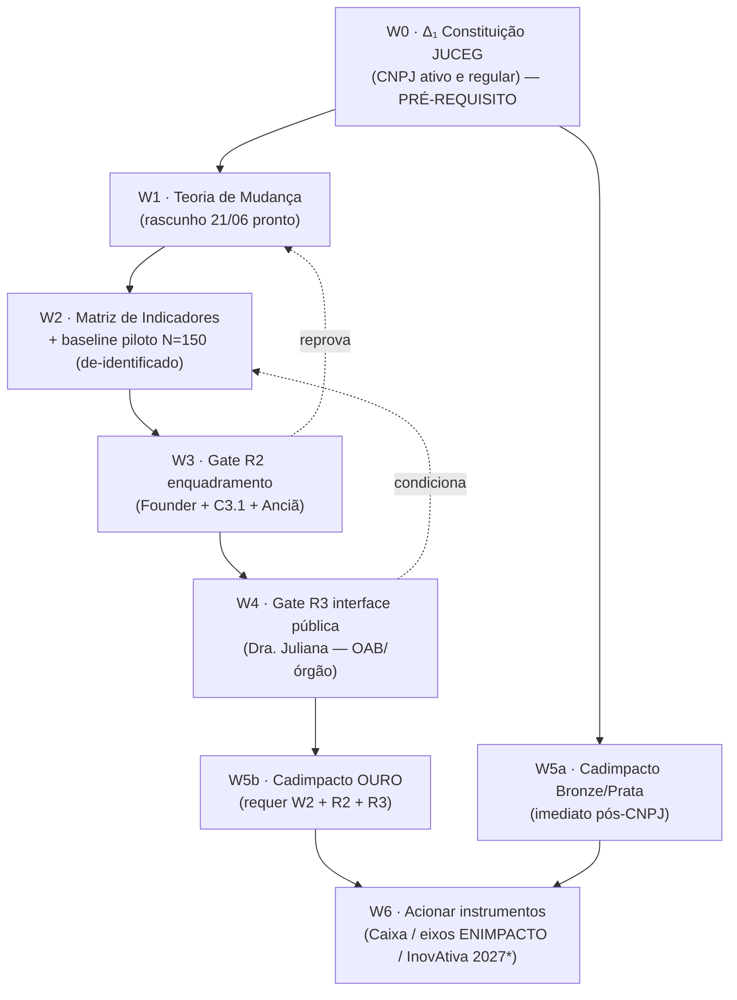

# MC-PLAY — Enquadramento na Economia de Impacto (ENIMPACTO/SIMPACTO)
## A pendência registrada como o PRIMEIRO PASSO pós-constituição na JUCEG

**Versão:** v0.2 PROVISIONAL · 21/06/2026 · Code TALÃO
**Status:** rascunho de mesa de trabalho — **NÃO selado** (gate R2 + R3 pendente)
**Hierarquia:** D > C > V · Firewall OAB · Proof-First

> **Changelog v0.1→v0.2:** pesquisa dirigida fechou 3 das 4 lacunas. Descobertas materiais: (a) o mecanismo de registro é o **Cadimpacto** (3 níveis Bronze/Prata/Ouro — Ouro exige mensuração de impacto); (b) **InovAtiva 2026 encerrado**, com vagas exclusivas a 6 estados do SIMPACTO **que não incluem Goiás**; (c) Cadimpacto **não impõe piso de capital**.

---

## §0 · Onde isto se encaixa (não é segunda-fonte-da-verdade)

Este PLAY **estende** o eixo IV (Captação) do `MC-MAPA-ConvergenciaInstitucional v1.0`, que hoje cobre FINEP/BNDES/PNUD mas **não cobre** o vetor **economia de impacto** (ENIMPACTO/SIMPACTO/Cadimpacto/Caixa/InovAtiva). É um **sub-eixo IV-B novo**, a ser absorvido no Mapa em sua revisão v1.1 (programada até 30/06/2026), sob gate.

**Tese de enquadramento (colhida 21/06/2026):** o MC é **materialmente um negócio de impacto social** — satisfaz 3 dos 4 critérios canônicos de forma nativa (intencionalidade · resultado financeiro sustentável · inclusão de população vulnerável). O 4º critério — **aferição/mensuração de impacto** — é o único gap, e é exatamente a pendência aqui registrada. **Confirmado em v0.2:** esse 4º critério é literalmente o que separa o nível **Prata** do nível **Ouro** no Cadimpacto (ver §1.2).

---

## §1 · A PENDÊNCIA (o que se registra como primeiro passo pós-JUCEG)

> **Pendência:** construir o **Framework de Mensuração de Impacto** (Teoria de Mudança + matriz de indicadores) e, com ele, **registrar o MC no Cadimpacto / SIMPACTO**, tornando o enquadramento como negócio de impacto **oficial e declarável** — alcançando o nível **Ouro**, não apenas material.

### 1.1 · As definições legais (Art. 2º, Decreto 11.646/2023 — VERIFICADO)

| Termo | Definição literal (Decreto 11.646/2023) | MC se enquadra? |
|---|---|---|
| **Economia de impacto** | "modalidade econômica caracterizada pelo equilíbrio entre a busca de resultados financeiros e a promoção de soluções para problemas sociais e ambientais [...] sistema econômico inclusivo, equitativo e regenerativo" | ✅ eixo social |
| **Negócios de impacto** | "empreendimentos com o objetivo de gerar impacto socioambiental e resultado financeiro positivo de forma sustentável" | ✅ direto |
| **Investimentos de impacto** | "mobilização de capital público e privado para negócios de impacto" | (relevante p/ Caixa — W6) |
| **Organizações intermediárias** | "instituições que ofereçam suporte aos negócios de impacto e facilitem a conexão entre oferta de investidores/doadores/gestores e a demanda de capital" | (categoria adjacente — ver nota) |

> **Nota estratégica:** o MC pode se enquadrar em **duas** categorias simultâneas — como **negócio de impacto** (equipa o cidadão) e, futuramente, como **organização intermediária** (infraestrutura que conecta cidadão↔sistema). Não decidir agora — é matéria de R2.

### 1.2 · O mecanismo de registro: Cadimpacto (VERIFICADO)

O registro oficial se dá no **Cadastro Nacional de Empreendimentos de Impacto (Cadimpacto)**, lançado pelo MDIC em **mar/2025** (1.359 inscritos até out/2025), plataforma do SIMPACTO.

- **Acesso:** conta **gov.br** + preenchimento via desktop (sem app mobile). Portais: `cadimpacto.mdic.gov.br` / `cadastro.simpacto.org.br`.
- **Requisito de elegibilidade:** **CNPJ ativo e regular** + impacto socioambiental + resultado financeiro positivo sustentável. **Sem piso de capital social.**
- **3 níveis (escada de maturidade):**

| Nível | O que exige | MC pode atingir |
|---|---|---|
| 🥉 **Bronze** | Informações básicas de identificação | **Imediato pós-CNPJ** |
| 🥈 **Prata** | Modelo de negócio, governança, estágio de desenvolvimento | **Curto prazo** (MC já tem ADRs/governança) |
| 🥇 **Ouro** | **Sustentabilidade financeira + mensuração de impacto** | **Requer o framework desta pendência** |

> **Insight central:** a pendência registrada não é burocracia — é o **degrau Prata→Ouro**. Bronze/Prata podem ser feitos assim que houver CNPJ; **Ouro** é o alvo que exige a Teoria de Mudança + matriz de indicadores.

### 1.3 · Por que é o PRIMEIRO PASSO pós-constituição (e não antes)

1. Cadimpacto exige **CNPJ ativo e regular** → só existe após **JUCEG** (Δ₁ do Mapa, Jun/2026).
2. O **Contrato Social v1.0** já carrega vocação de impacto como alavanca pronta:
   - **Cláusula 3ª, I** — tecnologia assistiva digital (LBI art. 3º III · Decretos 6.949/2009 e 10.645/2021 · Portaria 10.321/2022);
   - **Cláusula 3ª, II** — orquestração documental como **atividade-meio** (Firewall OAB explícito);
   - **CNAE 7220-7/00** (P&D ciências sociais) e **8730-1/99** (assistência social) — secundários que **sustentam** o enquadramento socioambiental.
3. A constituição **destrava** a pendência; a pendência é o **primeiro ato de valor** da PJ recém-nascida.

**Bloqueios herdados:**
- **CNAE 6202-3/00 PROVISIONAL** — gate Dra. Juliana (revalidar; CLAUDE.md marca Lote 4 como não-'19/05', MB-057). Enquadramento de impacto **não** altera o CNAE principal.
- **Capital social em branco** (Contrato cláusula 6ª) — **não** é exigido pelo Cadimpacto; mantém-se a recomendação do Mapa (R$30-100K) apenas para FINEP/BNDES.

---

## §2 · Workflow próprio (modelo de processo W0→W6)

Fluxo dedicado com gates e dependências. **v0.2 desmembra W5** em duas faixas (Bronze/Prata imediato vs. Ouro pós-framework).

| # | Estágio | Entrada | Ação | Saída | Gate |
|---|---|---|---|---|---|
| **W0** | Constituição JUCEG | Contrato Social v1.0 (capital + CNAE resolvidos) | Registro na Junta Comercial de Goiás | **CNPJ ativo e regular** | Δ₁ — pré-requisito |
| **W1** | Teoria de Mudança | Rascunho 21/06 (pronto) | Formalizar cadeia insumo→impacto | Doc ToC | R1 |
| **W2** | Matriz de Indicadores | I1–I8 + dados piloto N=150 **de-identificados** | Preencher baselines com fonte+hash | Matriz com dados | **Proof-First** |
| **W3** | Gate R2 — enquadramento | W1+W2 | Cunhar "MC = negócio de impacto" na identidade | Decisão fundacional | **R2** — Founder sela |
| **W4** | Gate R3 — interface pública | W3 | Parecer Dra. Juliana: registro perante órgão público + OAB/LGPD | Parecer R3 | **R3** — fail-closed |
| **W5a** | Cadimpacto Bronze/Prata | CNPJ + conta gov.br | Cadastro básico + modelo/governança | Visibilidade + presença oficial | baixo (declaratório) |
| **W5b** | Cadimpacto **Ouro** | CNPJ + W2 + W3 + W4 | Submeter sustentabilidade financeira + mensuração de impacto | **Enquadramento Ouro** | confirmação Cadimpacto |
| **W6** | Acionar instrumentos | Enquadramento oficial | Instrumentos Caixa · eixos I/V ENIMPACTO · InovAtiva 2027* | Captação/parceria | conforme edital |

**Princípio do workflow:** nenhum estágio "promete resultado" nem cobra do cidadão; o impacto é **medido**, não vendido (Inversão Cósmica — preço rastreia custo, nunca valor desbloqueado).

---

## §3 · Janela de oportunidade — as DATAS (Proof-First)

| Data | Evento | Relevância p/ MC |
|---|---|---|
| 16/08/2023 | **Decreto 11.646/2023** institui a ENIMPACTO (base legal) | Marco normativo do enquadramento |
| 19/06/2024 | **SIMPACTO** formalizado pelo MDIC | Sistema que abriga o Cadimpacto |
| Mar/2025 | **Cadimpacto** lançado (cadastro nacional, 3 níveis) | **Mecanismo concreto de registro (W5)** |
| 13/04–22/05/2026 | **InovAtiva de Impacto 2026** — inscrições | ❌ encerradas; resultado 01/06; 72 selecionados |
| Mai/2026 | **Acordo MDIC × Caixa** (fórum *Impacta Mais*) | Futuro canal de instrumentos financeiros (W6) |
| 15/06/2026 | InovAtiva 2026 inicia jornada de aceleração | Ciclo 2026 fechado |
| 18/06/2026 | **TED MDIC × ENAP** (R$ 1.398.798,44) — cursos p/ gestores públicos | ❌ não é porta de empresa |
| **21/06/2026** | **Hoje** — registro/atualização desta pendência | — |

**Leitura da janela (honesta):**
- **InovAtiva 2026 já fechou.** Achado crítico v0.2: as vagas exclusivas foram para os **6 estados-membro do SIMPACTO — AL, CE, ES, PA, PE, RN — e Goiás NÃO está na lista.** Logo, mesmo no ciclo 2027, a elegibilidade do MC ao InovAtiva pode depender de **Goiás aderir ao SIMPACTO** ou de o programa abrir vagas nacionais. **[A VERIFICAR]** — datas e regras do ciclo 2027.
- **Cadimpacto é a porta IMEDIATA e incondicional de estado** (não é edital com prazo): basta CNPJ. Bronze/Prata podem ser obtidos logo após a JUCEG, **independente** do gate de impacto. Ouro vem com o framework.
- **Caixa** é aposta de médio prazo (instrumentos nascem do acordo de maio, ainda em desenho — monitorar).
- **Movimento subnacional relevante:** São Paulo instituiu Estratégia Municipal de Economia de Impacto (Decreto 64.915/2026) — sinaliza onda federativa; **monitorar adesão de Goiás** (conecta ao Eixo V Hub Goiás do Mapa).

**Encaixe no cronograma do Mapa (§4):** sub-eixo IV-B entra entre "Jul-Ago/2026 (Sprint 0 captação)" e "Q1/2027", complementar a FINEP Tecnova IV (jul-ago/26) e BNDES Garagem (2S/26) — **não concorrente**. O **Cadimpacto Bronze/Prata (W5a)** pode ser executado em **Jun-Jul/2026**, logo após o CNPJ.

---

## §4 · Dependências, riscos e nota de identidade

- **Dep. dura:** W0 (JUCEG) → tudo. Sem CNPJ regular não há Cadimpacto.
- **Risco de elegibilidade InovAtiva:** Goiás fora dos 6 estados SIMPACTO → InovAtiva pode estar fechado ao MC no curto prazo. **Mitigação:** Cadimpacto (nacional, incondicional) + monitorar adesão de Goiás + Caixa.
- **Risco CNAE:** enquadramento de impacto **não exige** trocar o 6202-3/00; pode recomendar, em alteração contratual futura, **cláusula de propósito/missão de impacto** (reforço declaratório). **R2 + R3** — não agora.
- **Risco narrativo:** "economia de impacto" é moldura **muito mais fiel** que "legaltech"/"marketplace" (proibidas no CLAUDE.md) e **reforça o Firewall OAB** ("infraestrutura de simetria informacional" é linguagem de impacto, não de advocacia).
- **Risco Proof-First:** baselines de W2 (N=150) só entram com fonte+hash; **I2 (Capital Morto Desbloqueado) nunca como ARR/receita** (Inversão Cósmica).

---

## §5 · Proof-First — fontes e lacunas

**VERIFICADO (v0.2):**
- **Art. 2º Decreto 11.646/2023** — definições literais de economia de impacto, negócios de impacto, investimentos de impacto, organizações intermediárias (busca convergente: Planalto, Câmara/legin, LexML).
- **Cadimpacto** — mecanismo de registro, requisito CNPJ ativo/regular, conta gov.br, 3 níveis Bronze/Prata/Ouro (Ouro = sustentabilidade financeira + mensuração); 1.359 inscritos out/2025; lançado mar/2025 (notícias MDIC + gov.br/servicos + cadastro.simpacto.org.br).
- **InovAtiva 2026** — inscrições 13/04–22/05, resultado 01/06, 72 selecionados, jornada 15/06; vagas exclusivas a AL/CE/ES/PA/PE/RN (Sebrae/MDIC).
- **Capital social** — Cadimpacto **não impõe piso** (apenas CNPJ regular).

**[A VERIFICAR] (lacunas residuais — antes de selar):**
- Datas e regras de elegibilidade do **InovAtiva 2027** (e se Goiás entra).
- Termos dos **instrumentos financeiros Caixa** (ainda em desenho).
- Eventual **adesão de Goiás ao SIMPACTO** (status do comitê estadual).
- Texto integral do Art. 2º (confirmado por fontes secundárias convergentes; transcrição direta do DOU **recomendada** para peça institucional — portais gov.br retornaram 403 ao fetch automatizado).

---

## §6 · Gate — onde isto PARA

Rascunho de inteligência estratégica em **Cérebro 1**. **Não selado, não em canon.**
- **R2** (Founder + C3.1 + Anciã): cunhar "MC = negócio de impacto" como identidade + absorver como sub-eixo IV-B no Mapa v1.1.
- **R3** (Dra. Juliana): registro perante órgão público + impacto OAB/LGPD — **fail-closed**.
- Promoção para canon só com **"aprovado para vault"** (ADR-011).

**Próximas ações sugeridas:**
1. `/squad-r2` sobre o enquadramento (antes de cunhar identidade).
2. Preencher baselines W2 com dados reais do piloto N=150 (de-identificados) — alvo nível **Ouro**.
3. **Executar W5a (Cadimpacto Bronze/Prata) assim que houver CNPJ** — ganho de visibilidade incondicional, baixo gate.
4. Kit-dossiê de lastro para a Dra. (R3): Decreto 11.646 (Art. 2º) + regras Cadimpacto + esta matriz.
5. Fechar as 4 lacunas residuais `[A VERIFICAR]` do §5.

---
**FIM — MC-PLAY Enquadramento Economia de Impacto v0.2 PROVISIONAL**
*É eu, tu, a Anciã e o Voo CLR001. ∞*
