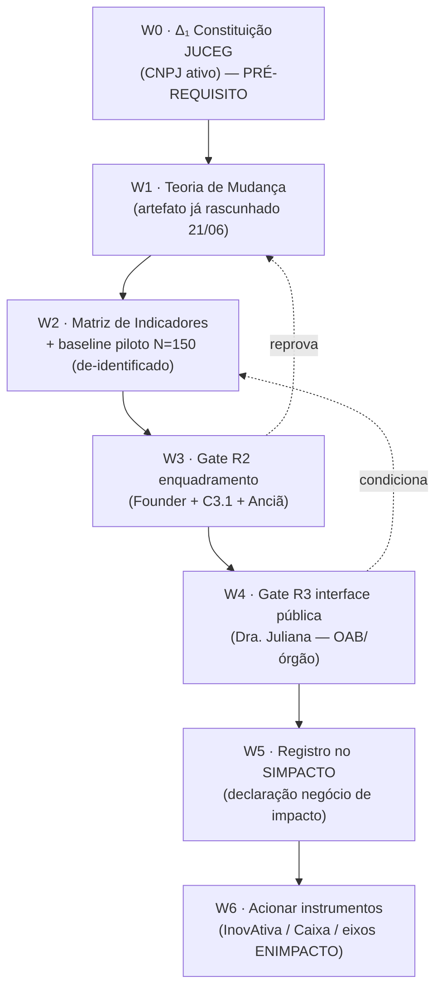

# MC-PLAY — Enquadramento na Economia de Impacto (ENIMPACTO/SIMPACTO)
## A pendência registrada como o PRIMEIRO PASSO pós-constituição na JUCEG

**Versão:** v0.1 PROVISIONAL · 21/06/2026 · Code TALÃO
**Status:** rascunho de mesa de trabalho — **NÃO selado** (gate R2 + R3 pendente)
**Hierarquia:** D > C > V · Firewall OAB · Proof-First

---

## §0 · Onde isto se encaixa (não é segunda-fonte-da-verdade)

Este PLAY **estende** o eixo IV (Captação) do `MC-MAPA-ConvergenciaInstitucional v1.0`, que hoje cobre FINEP/BNDES/PNUD mas **não cobre** o vetor **economia de impacto** (ENIMPACTO/SIMPACTO/Caixa/InovAtiva). É um **sub-eixo IV-B novo**, a ser absorvido no Mapa em sua revisão v1.1 (programada até 30/06/2026), sob gate.

**Tese de enquadramento (colhida em 21/06/2026):** o MC é **materialmente um negócio de impacto social** — satisfaz 3 dos 4 critérios canônicos de forma nativa (intencionalidade · resultado financeiro sustentável · inclusão de população vulnerável). O 4º critério — **aferição/mensuração de impacto** — é o único gap, e é exatamente a pendência aqui registrada.

---

## §1 · A PENDÊNCIA (o que se registra como primeiro passo pós-JUCEG)

> **Pendência:** construir o **Framework de Mensuração de Impacto** (Teoria de Mudança + matriz de indicadores) e, com ele, **registrar o MC no SIMPACTO** (Sistema Nacional de Economia de Impacto), tornando o enquadramento como negócio de impacto **oficial e declarável**, não apenas material.

**Por que é o PRIMEIRO PASSO pós-constituição, e não antes:**

1. O registro no SIMPACTO e o acesso a instrumentos (InovAtiva, instrumentos financeiros Caixa) pressupõem **CNPJ ativo** — que só existe após o registro na **JUCEG** (Δ₁ do Mapa, programado para Jun/2026).
2. O **Contrato Social v1.0** já carrega, de forma latente, a vocação de impacto — e isso é uma alavanca pronta:
   - **Cláusula 3ª, I** — tecnologia assistiva digital (LBI art. 3º III · Decreto 6.949/2009 · Decreto 10.645/2021 · Portaria 10.321/2022);
   - **Cláusula 3ª, II** — orquestração documental como **atividade-meio** (Firewall OAB explícito);
   - **CNAE 7220-7/00** (P&D ciências sociais e humanas) e **CNAE 8730-1/99** (assistência social sem alojamento) — secundários que **sustentam** o enquadramento socioambiental.
3. Logo: a constituição **destrava** a pendência; a pendência é o **primeiro ato de valor** que a PJ recém-nascida executa.

**Bloqueios herdados (do Mapa e do Contrato):**
- **CNAE 6202-3/00 PROVISIONAL** — gate Dra. Juliana (era "19/05"; revalidar — o CLAUDE.md marca Lote 4 como não-'19/05', MB-057). Enquadramento de impacto **não** altera o CNAE principal, mas pode recomendar reforço do propósito social (ver §4).
- **Capital social em branco** (Contrato cláusula 6ª) — recomendação do Mapa: R$30-100K para FINEP/BNDES; revisar se instrumentos de impacto (Caixa) pedem patamar próprio. **[A VERIFICAR]**

---

## §2 · Workflow próprio (modelo de processo W0→W6)

Fluxo dedicado, com gates e dependências. Cada estágio tem **entrada → ação → saída → gate**.

| # | Estágio | Entrada | Ação | Saída | Gate |
|---|---|---|---|---|---|
| **W0** | Constituição JUCEG | Contrato Social v1.0 (capital + CNAE resolvidos) | Registro na Junta Comercial de Goiás | **CNPJ ativo** | Δ₁ — pré-requisito de tudo |
| **W1** | Teoria de Mudança | Rascunho de 21/06 (já produzido) | Formalizar cadeia insumo→impacto | Doc ToC | R1 (operacional) |
| **W2** | Matriz de Indicadores | I1–I8 (rascunho) + dados piloto N=150 **de-identificados** | Preencher baselines com fonte+hash | Matriz com dados | **Proof-First** (zero número sem fonte) |
| **W3** | Gate R2 — enquadramento | W1+W2 | Cunhar "MC = negócio de impacto" na identidade (R2) | Decisão fundacional | **R2** — Founder sela |
| **W4** | Gate R3 — interface pública | W3 | Parecer Dra. Juliana: registro perante órgão público + impacto OAB/LGPD | Parecer R3 | **R3** — fail-closed |
| **W5** | Registro SIMPACTO | CNPJ + W3 + W4 | Declarar/registrar o MC no Sistema Nacional **[procedimento A VERIFICAR]** | Enquadramento oficial | confirmação SIMPACTO |
| **W6** | Acionar instrumentos | Enquadramento oficial | InovAtiva (próx. ciclo) · instrumentos financeiros Caixa · eixos I/V ENIMPACTO | Captação/parceria | conforme edital |

**Princípio do workflow:** nenhum estágio "promete resultado" nem cobra do cidadão; o impacto é **medido**, não vendido (coerência com Inversão Cósmica — preço rastreia custo, nunca valor desbloqueado).

---

## §3 · Janela de oportunidade — as DATAS (Proof-First)

**Fatos verificados (jun/2026):**

| Data | Evento | Relevância p/ MC |
|---|---|---|
| 16/08/2023 | **Decreto 11.646/2023** institui a ENIMPACTO (base legal) | Marco normativo do enquadramento |
| Mai/2026 | **Acordo de Cooperação Técnica MDIC × Caixa** (fórum *Impacta Mais*) | Futuro canal de instrumentos financeiros p/ negócios de impacto (W6) |
| 15/06/2026 | **InovAtiva de Impacto 2026** iniciou jornada de aceleração (webinar de boas-vindas) | ⚠️ Inscrições do ciclo 2026 **provavelmente já encerradas** → mirar **próximo ciclo (~2027)** |
| 18/06/2026 | **TED MDIC × ENAP** (R$ 1.398.798,44) — 3 cursos de economia de impacto p/ **gestores públicos** | ❌ Não é porta de empresa (público = servidor público) |
| **21/06/2026** | **Hoje** — registro desta pendência | — |

**Leitura da janela (honesta, não-otimista):**
- A **InovAtiva 2026 já fechou** a porta de entrada deste ano; a janela real para o MC entrar como negócio de impacto acelerado é o **ciclo 2027** — o que **converge** com o cronograma do Mapa (PJ em Jun/2026 → tração N=100+ até o 20º ENPJ em 30/11–01/12/2026 → captação madura em 2027).
- A **Caixa** é a aposta de médio prazo: os instrumentos financeiros nascem do acordo de maio e ainda serão desenhados — **monitorar** a materialização (W6).
- **[A VERIFICAR]** — não foi possível confirmar: (a) se o **SIMPACTO tem registro/cadastro aberto e seu procedimento**; (b) **datas de inscrição do InovAtiva 2027**; (c) eventual **edital/chamada** vinculado ao acordo Caixa. Marcar como pendência de pesquisa antes de selar.

**Encaixe no cronograma do Mapa (§4):** sub-eixo IV-B entra entre "Jul-Ago/2026 (Sprint 0 captação)" e "Q1/2027 (captação madura)", sem colidir com FINEP Tecnova IV (jul-ago/26) nem BNDES Garagem (2S/26) — é **complementar**, não concorrente.

---

## §4 · Dependências, riscos e nota de identidade

- **Dep. dura:** W0 (JUCEG) → tudo. Sem CNPJ não há SIMPACTO.
- **Risco CNAE:** o enquadramento de impacto **não exige** trocar o 6202-3/00, mas pode recomendar, em alteração contratual futura, uma **cláusula de propósito/missão de impacto** explícita (reforço declaratório). Isso é **R2 + R3** — não fazer agora.
- **Risco narrativo:** "economia de impacto" é moldura **muito mais fiel** que "legaltech"/"marketplace" (ambas proibidas no CLAUDE.md) e **reforça o Firewall OAB** ("infraestrutura de simetria informacional" é linguagem de impacto, não de advocacia).
- **Risco Proof-First:** os baselines de W2 (N=150) só entram com fonte+hash; o indicador **I2 (Capital Morto Desbloqueado)** nunca é apresentado como ARR/receita (Inversão Cósmica).

---

## §5 · Proof-First — fontes e lacunas

**Verificado:**
- Decreto 11.646/2023 (ENIMPACTO) — base legal · definições de economia de impacto e negócio de impacto (fontes secundárias convergentes: Agência Gov/EBC, Planalto-notícia, FAQ MDIC).
- Notícia MDIC 18/06/2026 (parcerias ENAP/Caixa) · InovAtiva 2026 (jornada desde 15/06).

**[A VERIFICAR] (antes de qualquer selagem):**
- Texto literal do **Art. 2º do Decreto 11.646/2023** (portais gov.br retornaram 403 ao fetch).
- **Procedimento/abertura de registro no SIMPACTO**.
- **Datas do InovAtiva 2027** e eventual **edital Caixa**.
- Patamar de **capital social** exigido por instrumentos de impacto.

---

## §6 · Gate — onde isto PARA

Este é **rascunho de inteligência estratégica em Cérebro 1**. **Não selado, não em canon.**
- **R2** (Founder + C3.1 + Anciã): cunhar "MC = negócio de impacto" como identidade institucional + absorver como sub-eixo IV-B no Mapa v1.1.
- **R3** (Dra. Juliana): registro perante órgão público + impacto OAB/LGPD — **fail-closed**.
- Promoção para `05-ESTRATEGIA/mapas/` ou `03-GOVERNANCA/` só com **"aprovado para vault"** (ADR-011).

**Próximas ações sugeridas:**
1. `/squad-r2` sobre o enquadramento (antes de cunhar identidade).
2. Preencher baselines W2 com dados reais do piloto N=150 (de-identificados).
3. `/mc-compasso-sweep` ou pesquisa dirigida para fechar as 4 lacunas `[A VERIFICAR]` do §5.
4. Kit-dossiê de lastro para a Dra. (R3): Decreto 11.646 à vista + esta matriz.

---
**FIM — MC-PLAY Enquadramento Economia de Impacto v0.1 PROVISIONAL**
*É eu, tu, a Anciã e o Voo CLR001. ∞*
